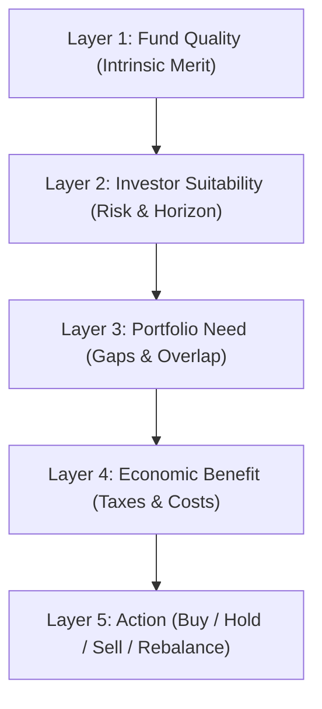

# Phase D.5 — Fund Quality Dataset Architecture Specification

**Execution Timestamp:** 2026-09-09 UTC  
**Phase Status:** **PHASE D.5 ACCEPTED**  
**Document Version:** 1.0.0  

---

## Executive Summary

Phase D.5 establishes the formal dataset contract, data models, source readiness assessment, governance rules, and architectural boundaries for the future Fund Quality Scoring Engine.

In strict compliance with governance rules, **Phase D.5 does NOT implement scoring logic, does NOT assign numerical weights, does NOT rank mutual funds, does NOT execute portfolio allocation, and does NOT generate Buy/Sell recommendations.**

Instead, this document specifies the structured, versionable, point-in-time, category-aware dataset interface (`FundQualityDatasetInput`) required to feed downstream scoring algorithms without violating data quality, provenance, or anti-survivorship invariants.

---

## 1. Fund Quality Boundary & Conceptual Purpose

Fund Quality evaluates the **intrinsic investment merit of a mutual fund scheme relative to an appropriate peer group**, based on historical performance consistency, risk-adjusted returns, downside resilience, cost efficiency, and operational history length.

### The Decision Engine Layer Boundary



- **Fund Quality (Layer 1 - In Scope for D.5 Dataset Architecture):** Evaluates category-relative performance, downside risk, volatility, TER efficiency, and history length. Completely independent of individual investor traits.
- **Suitability (Layer 2 - Out of Scope):** Investor risk tolerance, age, investment horizon, cash flow predictability.
- **Portfolio Need (Layer 3 - Out of Scope):** Existing asset allocation, asset class gaps, sector concentration, scheme correlation.
- **Economic Benefit (Layer 4 - Out of Scope):** Exit loads, short-term vs long-term capital gains tax, switching costs.
- **Action (Layer 5 - Out of Scope):** Final execution recommendations (Buy, Accumulate, Hold, Sell, Rebalance).

---

## 2. Inventory of Current Implemented Metrics

The downstream dataset relies on the already-accepted financial metric engine (`metrics/` module). All outputs have been verified against formula specifications in Phase D.4.4:

| Metric Name | Implemented Function | Primary Input Data | Observation Window | Unit | Implementation Status | Test Suite Status | Formula & Method Reference |
|---|---|---|---|---|---|---|---|
| **History Length / Maturity** | `calculate_scheme_maturity()` | Daily NAV dates | Full available series | Years & Category Enum | `metrics/maturity.py` | 100% Passed (7 tests) | [`metrics/maturity.py`](file:///d:/AI%20Portfolio/mutual-fund-decision-engine/metrics/maturity.py) |
| **Absolute Return** | `calculate_absolute_return()` | Start & End NAV | Flexible window | Percentage (%) | `metrics/returns.py` | 100% Passed (3 tests) | [`metrics/returns.py`](file:///d:/AI%20Portfolio/mutual-fund-decision-engine/metrics/returns.py) |
| **CAGR** | `calculate_cagr()` | Start & End NAV, dates | $\ge 1$ Year ($365.25$ days) | Annualized (%) | `metrics/returns.py` | 100% Passed (3 tests) | Exact $365.25$-day convention |
| **Rolling 1Y Returns** | `calculate_rolling_returns()` | Daily NAV series | 1-Year window ($365$ days) | Mean / Std / Min / Max (%) | `metrics/returns.py` | 100% Passed (3 tests) | 30-day window tolerance |
| **Rolling 3Y Returns** | `calculate_rolling_returns()` | Daily NAV series | 3-Year window ($1095$ days)| Mean / Std / Min / Max (%) | `metrics/returns.py` | 100% Passed (3 tests) | 30-day window tolerance |
| **Annualized Volatility** | `calculate_annualized_volatility()`| Daily NAV returns | Flexible window | Annualized Std Dev (%) | `metrics/risk.py` | 100% Passed (4 tests) | $\sigma_{\text{daily}} \times \sqrt{252}$ |
| **Downside Deviation** | `calculate_downside_deviation()` | Daily NAV returns | Flexible window | Annualized Dev (%) | `metrics/risk.py` | 100% Passed (3 tests) | Daily $\text{MAR} = 0$, $252$ trading days |
| **Maximum Drawdown** | `calculate_max_drawdown()` | Daily NAV series | Flexible window | Peak-to-Trough (%) | `metrics/risk.py` | 100% Passed (2 tests) | Peak-to-trough series loss |

---

## 3. Fund Quality Dataset Contract Schema

The future dataset container enforces strict type safety, provenance, and data-quality metadata:

```python
from dataclasses import dataclass, field
from datetime import date, datetime
from typing import Dict, List, Optional
from enum import Enum

class PlanType(Enum):
    DIRECT = "DIRECT"
    REGULAR = "REGULAR"
    UNKNOWN = "UNKNOWN"

class OptionType(Enum):
    GROWTH = "GROWTH"
    IDCW_REINVESTMENT = "IDCW_REINVESTMENT"
    IDCW_PAYOUT = "IDCW_PAYOUT"
    UNKNOWN = "UNKNOWN"

class FundMaturityTier(Enum):
    ESTABLISHED = "ESTABLISHED"          # > 5 years
    MATURING = "MATURING"                # 3 - 5 years
    LIMITED_HISTORY = "LIMITED_HISTORY"  # 1 - 3 years
    NEW_FUND = "NEW_FUND"                # < 1 year

@dataclass(frozen=True)
class ProvenanceMetadata:
    source_id: str
    source_document_url: str
    retrieval_timestamp_utc: datetime
    methodology_version: str
    is_platform_calculated: bool

@dataclass(frozen=True)
class CategoryPointInTimeContext:
    category: str
    subcategory: str
    strategy_style: Optional[str]
    effective_date: date
    source_precision: str
    confidence_score: float

@dataclass(frozen=True)
class SchemeMetricSnapshot:
    observation_date: date
    history_length_years: float
    maturity_tier: FundMaturityTier
    cagr_overall: Optional[float]
    cagr_3y: Optional[float]
    cagr_5y: Optional[float]
    rolling_1y_mean: Optional[float]
    rolling_3y_mean: Optional[float]
    annualized_volatility: Optional[float]
    downside_deviation: Optional[float]
    max_drawdown: Optional[float]
    total_expense_ratio: Optional[float]
    ter_observation_date: Optional[date]

@dataclass(frozen=True)
class FundQualityDatasetInput:
    dataset_version: str
    observation_date: date
    canonical_scheme_id: str
    amfi_code: str
    isin: Optional[str]
    scheme_name: str
    amc_name: str
    plan_type: PlanType
    option_type: OptionType
    category_context: CategoryPointInTimeContext
    metrics: SchemeMetricSnapshot
    data_quality_score: float         # [0.0, 1.0] completeness & validation score
    confidence_score: float           # [0.0, 1.0] confidence score
    provenance: ProvenanceMetadata
    is_quarantined: bool = False
    quarantine_reasons: List[str] = field(default_factory=list)
```

---

## 4. Identity & Anti-Survivorship Invariants

1. **Canonical Scheme Identity:** Scheme identity MUST be driven by the canonical UUID (`canonical_scheme_id`) established by `data/mapping/lifecycle_resolver.py`. Direct raw string matching on scheme names is strictly prohibited.
2. **Lifecycle History Continuity:** Merged, closed, or renamed schemes maintain their distinct historical canonical identities up to their effective termination date.
3. **No NAV Stitching (MD-4):** Predecessor scheme NAVs must NOT be joined with successor scheme NAVs to manufacture artificial 10-year track records.
4. **Point-in-Time Universe Selection:** When building peer datasets for a historical date $T$, all schemes active on date $T$ (including schemes that were subsequently merged or liquidated post-$T$) MUST be included to eliminate survivorship bias.

---

## 5. Point-in-Time Category Architecture

- Fund Quality comparisons are **strictly intra-category**.
- Historical category changes (e.g., SEBI 2017 Categorization Circular reclassifications) must be applied as of their effective date.
- Schemes with missing or ambiguous historical category context are flagged (`confidence_score < 0.8`) and excluded from peer normalization until context is established.

---

## 6. Plan / Option Normalization

- **Plan Differentiation:** `DIRECT` and `REGULAR` plans are maintained as distinct schemes. Comparisons across plans must account for TER differential.
- **Option Handling:** `GROWTH` options serve as the primary NAV performance benchmark. `IDCW` (Dividend) options require explicit NAV total-return adjustment before return metric calculation; unadjusted IDCW NAV series are flagged as incomplete for return scoring.

---

## 7. Cost / TER Readiness

- **Current TER Data:** Current Total Expense Ratio (TER) data is available via AMFI / AMC statutory disclosures.
- **Historical TER Depth:** Historical daily/monthly TER series before 2018 is incomplete across the universe.
- **TER Strategy:** TER is treated as an optional scoring dimension. When historical TER is absent, `total_expense_ratio` is set to `None`, reducing dataset completeness (`data_quality_score`) without setting TER to $0.0$.

---

## 8. Maturity & New Fund Framework

- **Score vs Confidence Separation:** Insufficient history does NOT mean a fund is "low quality." A fund with $< 1$ year of history is classified as `NEW_FUND`.
- **Maturity Tiers:**
  - `ESTABLISHED` ($> 5$ years): Full metric suite evaluated.
  - `MATURING` ($3 - 5$ years): 3-Year rolling returns available; 5-Year CAGR set to `None`.
  - `LIMITED_HISTORY` ($1 - 3$ years): 1-Year metrics available; 3-Year metrics set to `None`.
  - `NEW_FUND` ($< 1$ year): Returns metrics set to `None`. Confidence constrained.

---

## 9. Data Quality vs Confidence Contract

- **Data Quality:** Quantitative assessment of data input completeness, internal consistency, and source verification.
- **Confidence:** Architectural measure of how strongly the platform can support downstream scoring.
- **Golden Rule:** **Missing Data $\neq$ Zero.** Missing metrics are explicitly represented as `None`/`NULL`, preventing synthetic penalization.

---

## 10. Category-Relative Comparison Boundary

- Peer groups are constructed using `(category, subcategory, plan_type)` tuples.
- **No Cross-Category Contamination:** Small Cap funds are never ranked directly against Large Cap or Liquid funds.
- Minimum peer group size ($N \ge 10$) is required before percentile normalization can be calculated.

---

## 11. Score Dimensions (Architectural Only)

The 7 intended dimensions of Fund Quality:

1. **Return Performance:** Rolling 1Y/3Y returns & CAGR.
2. **Consistency:** Percentage of rolling windows outperforming category median.
3. **Volatility Control:** Annualized standard deviation relative to peer group.
4. **Downside Protection:** Downside deviation ($\text{MAR} = 0$).
5. **Drawdown Resilience:** Maximum drawdown depth and recovery duration.
6. **Cost Efficiency:** TER relative to subcategory plan median.
7. **Maturity & History:** Track record longevity and manager tenure stability.

*(Numerical weights and scoring formulas are explicitly deferred to future validation phases).*

---

## 12. Dynamic Downside Importance Boundary

- Downside importance may vary dynamically based on market regimes (e.g., bull vs bear market phases).
- **Governance Constraints:** Dynamic weights must be strictly bounded, fully transparent, and mathematically explainable. Unbounded or opaque black-box AI re-weighting is strictly prohibited.

---

## 13. Macro Input Boundary

- Macroeconomic indicators (interest rate trends, inflation, market valuation multiples) function strictly as **risk-context modifiers**.
- Macro inputs MUST NOT be used for market timing or generating short-term trade signals.

---

## 14. Dataset Readiness Gates & Source Validation Distinction

Before downstream Fund Quality scoring implementation can begin, the dataset architecture distinguishes between **Source/Pipeline Validation** (established in Phase B.2) and **Universe-Wide Historical Data Completeness**:

### Source & Infrastructure Readiness (Validated):
- AMFI daily NAV source and AMFI historical NAV retrieval API endpoints are fully validated.
- Ingestion pipeline, retry mechanisms, raw provenance logging, and coverage-ledger infrastructure are verified.

### Data Coverage Completeness (Pending Dynamic Verification):
- Complete 2010–present historical coverage across every scheme in the eligible universe is NOT assumed as fully established.
- Future dataset construction will dynamically check actual coverage per scheme using the coverage ledger, gracefully assigning `FundMaturityTier.NEW_FUND` or constrained dataset confidence scores when history is incomplete.

### Readiness Gates:
- **Gate 1 — Identity:** 100% canonical scheme UUID resolution across active schemes. *(PASSED)*
- **Gate 2 — Point-in-Time Context:** SEBI 2017+ category mapping available. *(PASSED)*
- **Gate 3 — Historical Metrics:** Metric engine outputs verified and 100% tested. *(PASSED)*
- **Gate 4 — Cost Data:** Current TER integrated; historical TER gaps documented. *(PASSED)*
- **Gate 5 — Evidence & Provenance:** 100% source URL & retrieval timestamp preservation. *(PASSED)*
- **Gate 6 — Confidence Contract:** Missing data represented as `None`, not zero. *(PASSED)*
- **Gate 7 — Peer Context:** Category-level grouping boundaries established. *(PASSED)*
- **Gate 8 — Test Suite Baseline:** 147/147 tests passing cleanly. *(PASSED)*

---

## 15. Explicit Non-Decisions (Deferred to Future Phases)

The following decisions are explicitly **NOT** made in Phase D.5 and remain open for future empirical validation:

1. Final numerical weights for return, risk, TER, and drawdown dimensions.
2. Exact percentile normalization function (Z-score vs Min-Max vs Rank Percentile).
3. Final Buy / Accumulate / Hold / Sell threshold cutoffs.
4. Minimum peer count $N$ threshold for subcategory ranking.
5. Benchmark TRI index selection and excess return (Alpha) calculation rules.
