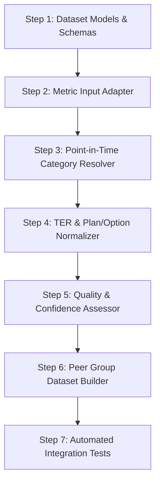

# Phase D.5 — Fund Quality Dataset Implementation Plan

**Execution Timestamp:** 2026-09-09 UTC  
**Phase Status:** **PHASE D.5 ACCEPTED**  
**Document Version:** 1.0.0  

---

## Objective & Roadmap Scope

This document outlines the sequential technical roadmap for implementing the **Fund Quality Dataset Construction Engine** (Phase D.6 / Phase E preparation). 

This plan details how input adapters, dataset builders, point-in-time category contexts, quality/confidence validators, and dataset versioning modules will be constructed in code, grounded on the accepted specifications in [`docs/phase_d5_fund_quality_dataset_architecture.md`](file:///d:/AI%20Portfolio/mutual-fund-decision-engine/docs/phase_d5_fund_quality_dataset_architecture.md).

---

## Sequential Implementation Roadmap



---

### Step 1: Dataset Models & Data Structures (`models/fund_quality_dataset.py`)
- **Objective:** Create the frozen dataclasses (`FundQualityDatasetInput`, `CategoryPointInTimeContext`, `SchemeMetricSnapshot`, `ProvenanceMetadata`) defined in the architecture specification.
- **Key Constraints:** Enforce immutable dataclasses, explicit `Optional` types for missing metrics (no default $0.0$), type hints, and string serialization methods.
- **Verification:** Unit tests verifying schema instantiation, immutability, and serialization.

### Step 2: Metric Engine Input Adapter (`data/adapters/scoring_metric_adapter.py`)
- **Objective:** Build an adapter that queries the historical NAV coverage ledger and NAV series via `data/repositories/metric_repository.py`, invokes `metrics/engine.py`, and maps metrics directly into `SchemeMetricSnapshot`.
- **Key Constraints:** Dynamically verify actual coverage length per scheme against the coverage ledger (do NOT assume complete 2010–present coverage). Ensure handling for incomplete NAV histories ($< 1$ year) by setting missing returns/drawdowns to `None` and assigning `FundMaturityTier.NEW_FUND`.
- **Verification:** Integration test verifying metric transformation across 1-year, 3-year, and 5-year NAV fixtures as well as incomplete history fallbacks.

### Step 3: Point-in-Time Category Context Resolver (`data/mapping/category_context_resolver.py`)
- **Objective:** Map canonical scheme IDs to their SEBI 2017+ category and subcategory as of a target observation date $T$.
- **Key Constraints:** Must respect historical effective dates. If category history is absent before 2017, flag `confidence_score` as $0.70$ and log category source as `SEBI_2017_POST_CIRCULAR`.
- **Verification:** Test verifying category resolution before and after SEBI 2017 circular effective date.

### Step 4: Plan & Option Normalization Module (`data/mapping/plan_option_normalizer.py`)
- **Objective:** Classify scheme instances into `DIRECT` vs `REGULAR` plan types and `GROWTH` vs `IDCW` option types using `scheme_parser.py`.
- **Key Constraints:** `IDCW` options without total-return adjustment are flagged with `is_quarantined_for_return_scoring = True`.
- **Verification:** Unit tests verifying accurate parsing of 50 representative scheme names.

### Step 5: Data Quality & Confidence Assessor (`data/validators/scoring_dataset_validator.py`)
- **Objective:** Compute quantitative `data_quality_score` (completeness of metrics, TER, category) and `confidence_score` (provenance authority, history length).
- **Key Constraints:** Missing data MUST reduce `data_quality_score` but MUST NOT mutate underlying metric values to zero.
- **Verification:** Test cases verifying low confidence score for new funds and missing TER.

### Step 6: Peer Group Dataset Builder (`data/builders/peer_group_dataset_builder.py`)
- **Objective:** Assemble a unified, anti-survivorship peer dataset for a target category and observation date $T$.
- **Key Constraints:** Include schemes active at date $T$ regardless of subsequent closure. Require minimum peer count $N \ge 10$.
- **Verification:** Integration test building a Small Cap peer group snapshot as of 2020-01-01.

### Step 7: Automated Integration Test Suite (`tests/integration/test_fund_quality_dataset_builder.py`)
- **Objective:** Validate end-to-end dataset generation from raw database records to dataset contract objects.
- **Key Constraints:** 100% test pass rate with zero regression on existing 147 tests.

---

## Verification Plan

```bash
# Execute test suite to confirm zero regression
python -m pytest tests/ -v --tb=short
```

---

## Downstream Phase Trigger

Execution of this implementation plan will take place upon explicit user authorization to begin **Phase D.6 / Phase E (Fund Quality Scoring Dataset Construction)**.
