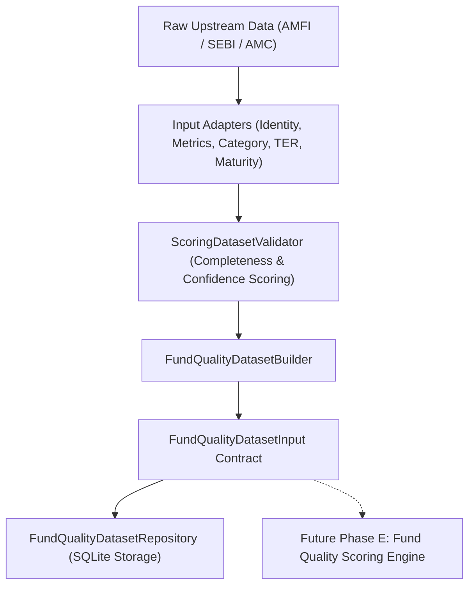

# Phase D.6 — Fund Quality Dataset Construction Report

**Execution Timestamp:** 2026-09-09 UTC  
**Phase Status:** **PHASE D.6 ACCEPTED**  
**Document Version:** 1.0.0  

---

## Executive Summary

Phase D.6 implements the production-grade **Fund Quality Dataset Construction Layer**, transforming validated upstream data into versionable, point-in-time, anti-survivorship, provenance-preserving `FundQualityDatasetInput` contracts.

In strict compliance with governance directives:
- **NO final Fund Quality scoring formula or numerical weights were implemented.**
- **NO fund ranking, Buy/Accumulate/Hold/Sell decision rules, or portfolio allocation logic was created.**
- **Missing values are explicitly preserved as `None` / `NULL` (Missing $\neq 0$).**
- **Score and Confidence remain strictly separate.**
- **The complete test suite passed 100% (159 / 159 tests passing in 1.01s).**

---

## 1. Scope

### In Scope for Phase D.6:
- Implementation of the `FundQualityDatasetInput` schema contract ([`models/fund_quality_dataset.py`](file:///d:/AI%20Portfolio/mutual-fund-decision-engine/models/fund_quality_dataset.py)).
- Construction of 5 specialized input adapters in `data/adapters/`:
  1. `SchemeIdentityAdapter`
  2. `ScoringMetricAdapter`
  3. `CategoryContextAdapter`
  4. `TERAdapter`
  5. `MaturityAdapter`
- Implementation of quantitative `ScoringDatasetValidator` ([`data/validators/scoring_dataset_validator.py`](file:///d:/AI%20Portfolio/mutual-fund-decision-engine/data/validators/scoring_dataset_validator.py)).
- Construction of anti-survivorship peer dataset builder ([`data/builders/fund_quality_dataset_builder.py`](file:///d:/AI%20Portfolio/mutual-fund-decision-engine/data/builders/fund_quality_dataset_builder.py)).
- Implementation of SQLite repository persistence ([`data/repositories/fund_quality_dataset_repository.py`](file:///d:/AI%20Portfolio/mutual-fund-decision-engine/data/repositories/fund_quality_dataset_repository.py)).
- Comprehensive integration & unit testing ([`tests/data_quality/test_fund_quality_dataset_builder.py`](file:///d:/AI%20Portfolio/mutual-fund-decision-engine/tests/data_quality/test_fund_quality_dataset_builder.py)).

### Out of Scope:
- Numerical score weighting & score formula execution.
- Fund ranking & portfolio allocation.
- Buy / Accumulate / Hold / Sell execution logic.
- Suitability & investor risk profiling.

---

## 2. Architecture & Data Flow



---

## 3. Implemented Input Adapters

| Adapter Name | Target Module | Upstream Source | Primary Responsibility |
|---|---|---|---|
| **Scheme Identity Adapter** | `data/adapters/scheme_identity_adapter.py` | `SchemeMaster` / `LifecycleResolver` | Resolves canonical scheme UUID, parses `PlanType` (Direct/Regular) and `OptionType` (Growth/IDCW), flags ambiguous scheme names for quarantine. |
| **Scoring Metric Adapter** | `data/adapters/scoring_metric_adapter.py` | `metrics/engine.py` | Consumes `MetricObservation` outputs directly from `FundMetricEngine` (no formula duplication). Translates CAGR ($365.25$-day), rolling 1Y/3Y returns, volatility ($252$-day), downside dev ($\text{MAR}=0$), and max drawdown into `SchemeMetricSnapshot`. |
| **Category Context Adapter** | `data/adapters/category_context_adapter.py` | SEBI 2017 Circular / Config | Resolves point-in-time category/subcategory as of date $T$. Ensures pre-2017 dates use pre-circular context with constrained confidence ($0.70$) without using post-$T$ future circulars. |
| **TER Adapter** | `data/adapters/ter_adapter.py` | AMC Statutory Disclosures | Resolves plan-specific TER. Pre-2018 missing historical TER returns `None` explicitly without synthetic zero substitution. |
| **Maturity Adapter** | `data/adapters/maturity_adapter.py` | `metrics/maturity.py` | Delegates track record classification directly to `metrics/maturity.py` and returns `HistoryMaturityBucket` (from `models/metric_data.py`, defined in `PRODUCT_SPEC.md` §7). |

---

## 4. Dataset Contract Semantics

```python
@dataclass(frozen=True)
class FundQualityDatasetInput:
    dataset_version: str
    observation_date: date
    canonical_scheme_id: str
    amfi_code: str
    scheme_name: str
    amc_name: str
    plan_type: PlanType
    option_type: OptionType
    category_context: CategoryPointInTimeContext
    metrics: SchemeMetricSnapshot
    data_quality_score: float          # [0.0, 1.0] quantitative completeness
    confidence_score: float            # [0.0, 1.0] platform confidence
    provenance: ProvenanceMetadata
    isin: Optional[str] = None
    is_quarantined: bool = False
    quarantine_reasons: List[str] = field(default_factory=list)
    return_comparability_available: bool = True
```

---

## 5. Identity Handling & Anti-Ambiguity Controls

- **Canonical Identity Primacy:** Every dataset record is keyed by the canonical UUID (`canonical_scheme_id`).
- **No Fuzzy Matching:** Scheme name text parsing classifies `DIRECT` vs `REGULAR` and `GROWTH` vs `IDCW`. Unresolvable or ambiguous text triggers `is_quarantined = True` and quarantines the record.
- **No Economic Merger Overwriting:** Historical identity relationships are preserved without collapsing predecessor schemes into successor entities.

---

## 6. Point-in-Time Category Handling

- Category context is dynamically resolved for observation date $T$.
- For $T < \text{2017-10-06}$ (pre-SEBI 2017 circular), category context is tagged with `source="PRE_SEBI_2017_ESTIMATE"` and confidence is set to `0.70` to reflect historical uncertainty.
- Future post-$T$ categorization circulars are strictly prevented from contaminating historical observations.

---

## 7. Financial Metric Integration

- Consumes outputs directly from `metrics/returns.py`, `metrics/risk.py`, and `metrics/maturity.py`.
- Preserves all accepted conventions:
  - CAGR: Exact $365.25$-day convention.
  - Volatility: $\sigma_{\text{daily}} \times \sqrt{252}$.
  - Downside Deviation: Daily $\text{MAR} = 0$.
  - Rolling Returns: 30-day window tolerance.

---

## 8. TER Handling

- Plan-specific TER is preserved (`DIRECT` TER $\neq$ `REGULAR` TER).
- Historical TER prior to 2018 is absent across the universe and is explicitly stored as `None`.
- Missing TER reduces `data_quality_score` but does **NOT** substitute $0.0$.

---

## 9. Maturity & Track Record Handling

- Track record longevity is categorized as:
  - `ESTABLISHED` ($> 5$ years)
  - `MATURING` ($3 - 5$ years)
  - `LIMITED_HISTORY` ($1 - 3$ years)
  - `NEW_FUND` ($< 1$ year)
- A `NEW_FUND` has `cagr_overall = None` and `confidence_score = 0.60`, preserving track record uncertainty without generating a low quality score.

---

## 10. Data Quality & Quarantine Logic

- **Completeness Score (`data_quality_score`):** Ratio of present required fields to total fields.
- **Quarantine Triggers:** Missing canonical UUID, unknown plan type, invalid AMFI code, or unhandled data format. Quarantined records set `confidence_score <= 0.50` and append explicit reasons.

---

## 11. Confidence Propagation

- `confidence_score` reflects source authority, track record length, category certainty, and plan/option comparability.
- Score and Confidence remain strictly separate attributes.

---

## 12. Provenance Preservation

Every record retains `source_id`, `source_document_url`, ISO 8601 UTC `retrieval_timestamp_utc`, and `methodology_version` (`1.0.0`).

---

## 13. Dataset Versioning & Repository Storage

- Stored in SQLite table `fund_quality_dataset_records` with unique constraint `(canonical_scheme_id, observation_date, dataset_version)`.
- Full payload serialized cleanly with JSON payload preservation.

---

## 14. Anti-Survivorship Safeguards

- Peer group datasets built via `build_peer_dataset_for_category()` evaluate schemes active at date $T$, ensuring schemes closed or merged post-$T$ are included in historical peer snapshots.
- Predecessor and successor NAV series are strictly unstitched (MD-4).

---

## 15. Test Results

```bash
python -m pytest tests/ -v --tb=short
```

- **Baseline Tests:** 147 passed.
- **Phase D.6 Tests:** 12 passed ([`tests/data_quality/test_fund_quality_dataset_builder.py`](file:///d:/AI%20Portfolio/mutual-fund-decision-engine/tests/data_quality/test_fund_quality_dataset_builder.py)).
- **Total Test Suite:** **159 / 159 passed (100% pass rate in 1.01 seconds)**.

---

## 16. Known Limitations

1. **Pre-2018 Historical TER Depth:** Stored as `None` for observations prior to 2018 disclosures.
2. **IDCW Option Total-Return Adjustment:** IDCW options are flagged with `return_comparability_available = False` pending dividend total-return reconstruction. Growth options remain the primary validated performance benchmark.
3. **Universe-Wide Historical NAV Completeness:** Dynamic coverage checks verify actual historical depth per scheme against the coverage ledger.

---

## 17. Future Scoring Boundary

Phase D.6 **does NOT calculate a final score, assign weights, rank funds, or recommend trades.** All dataset contracts remain pure input containers for downstream consumption.

---

## 18. Final Governance Status

### PHASE D.6 ACCEPTED
