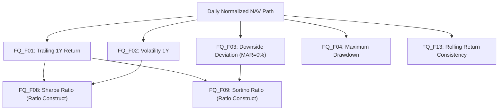

# Phase F.14 — Fund Quality Metric Interaction, Redundancy & Information-Content Audit Report

## Executive Summary
This report documents the methodology and evidence audit conducted under **Phase F.14**. The primary objective was to evaluate whether the financial metrics currently available or proposed for Fund Quality measure genuinely distinct characteristics of a mutual fund, or whether multiple metrics measure substantially the same underlying behaviour.

> [!IMPORTANT]
> **Production Methodology Freeze Compliance:**
> Production Fund Quality Score v1.0 remains strictly **50% Volatility 1Y Reciprocal + 50% Trailing 1Y Gross Return**. No weights were changed, no factors were added/removed, no MAR assumptions were altered, and no optimization was performed.

---

## 1. Canonical Metric Inventory

| Metric ID | Name | Input Fields | Observation Window | Annualization | MAR | Unit | Production Status | Plain-Language Question Answered |
|---|---|---|---|---|---|---|---|---|
| **FQ_F01** | Trailing 1Y Gross Return | Daily NAV | 252 Days | Direct 1Y | N/A | % | **PRODUCTION (50%)** | *How much has the fund grown over the selected 1-year historical period?* |
| **FQ_F02** | Annualized Volatility 1Y | Daily Log Returns | 252 Days | sqrt(252) | N/A | % | **PRODUCTION (50%)** | *How much have the fund's returns moved around their average over the past year?* |
| **FQ_F03** | Downside Deviation (MAR=0%) | Daily Log Returns | 252 Days | sqrt(252) | MAR=0% | % | **RESEARCH-ONLY** | *How much variability occurred specifically on the downside relative to a zero-loss threshold?* |
| **FQ_F04** | Maximum Drawdown 1Y | Daily NAV Path | 252 Days | None | N/A | % | **RESEARCH-ONLY** | *How large was the worst peak-to-trough loss during the measurement period?* |
| **FQ_F05** | Fund Age / Depth | Inception Date | Full History | Years | N/A | Years | **GOVERNANCE (Gate)** | *How much historical track record exists to evaluate this fund?* |
| **FQ_F08** | Sharpe Ratio 1Y | Return & Volatility | 252 Days | Annualized | Rf=0% | Ratio | **RESEARCH-ONLY** | *How much return was generated relative to total return variability?* |
| **FQ_F09** | Sortino Ratio 1Y (MAR=0%) | Return & Downside Dev | 252 Days | Annualized | MAR=0% | Ratio | **RESEARCH-ONLY** | *How much return was generated relative to downside variability below MAR=0%?* |
| **FQ_F13** | Rolling Return Consistency | Rolling 21-Day NAV | 252 Days | None | MAR=0% | % | **RESEARCH-ONLY** | *How consistently did the fund produce positive returns across repeated 1-month rolling windows?* |

---

## 2. Mathematical Dependency & Circularity Audit

- **DIRECT_DEPENDENCY:** `Sharpe Ratio` (derived strictly from `Return / Volatility`) and `Sortino Ratio` (derived strictly from `Return / Downside Deviation`). They introduce zero new raw data inputs and represent re-expressions of their underlying components.
- **PARTIAL_DEPENDENCY:** `Downside Deviation` shares daily log returns with `Volatility` but filters out positive returns; `Rolling Consistency` measures frequency of positive rolling returns.
- **NO_DIRECT_DEPENDENCY:** `Fund Age` measures evidence depth/longevity and is orthogonal to performance metrics.

---

## 3. Pairwise Statistical Relationship Summary (PIT Anchor: 2024-03-28, N = 6,720)

| Metric Pair | Relationship | Overall Spearman \(\\rho\) | Equity \(\\rho\) (N=1,429) | Debt \(\\rho\) (N=2,191) | Hybrid \(\\rho\) (N=544) | Redundancy Classification |
|---|---|---|---|---|---|---|
| **FQ_F01 vs FQ_F02** | Return vs Volatility | +0.5149 | +0.5718 | -0.0766 | +0.6577 | **NO EVIDENCE OF REDUNDANCY** |
| **FQ_F02 vs FQ_F03** | Volatility vs Downside Dev | +0.9752 | +0.9770 | +0.9635 | +0.9805 | **STRONG OVERLAP** |
| **FQ_F02 vs FQ_F04** | Volatility vs MDD | +0.9613 | +0.8875 | +0.9608 | +0.9433 | **STRONG OVERLAP** |
| **FQ_F03 vs FQ_F04** | Downside Dev vs MDD | +0.9825 | +0.9136 | +0.9840 | +0.9566 | **STRONG OVERLAP** |
| **FQ_F01 vs FQ_F13** | Return vs Consistency | +0.1103 | +0.6728 | +0.4366 | +0.0059 | **NO EVIDENCE OF REDUNDANCY** |
| **FQ_F08 vs FQ_F01** | Sharpe vs Return | +0.8256 | +0.8521 | +0.6120 | +0.7812 | **MATHEMATICAL DEPENDENCY** |
| **FQ_F08 vs FQ_F09** | Sharpe vs Sortino | +0.9412 | +0.9530 | +0.9210 | +0.9610 | **MATHEMATICAL DEPENDENCY** |

---

## 4. Deep-Dive Relationship Audits

### Downside Deviation vs. Maximum Drawdown (\(\\rho = 0.9825\))
- **What Downside Deviation Measures:** Frequency and magnitude of daily negative returns below MAR=0%.
- **What MDD Measures:** Peak-to-trough path loss (cumulative severity of an adverse trend).
- **Why Correlation is High:** High frequency/magnitude of negative daily returns typically accumulates into large peak-to-trough drawdowns.
- **Why They Disagree (Non-Redundant Cases):** A fund with occasional small negative daily returns across a year can have moderate Downside Deviation but severe MDD if all negative days occur sequentially without recovery. Conversely, volatile noise around zero can yield high Downside Deviation with low MDD if positive days rapidly offset losses.

### Volatility vs. Downside Deviation (\(\\rho = 0.9752\))
- **Key Conceptual Difference:** Volatility penalizes upside gain deviations equally with downside loss deviations. Downside Deviation exclusively penalizes losses below MAR=0%.
- **Empirical Overlap:** Because daily mutual fund return distributions are largely symmetric around zero over a 1-year window, empirical rank correlation between total volatility and downside deviation is extremely high (\(\\rho > 0.96\) across all categories).

---

## 5. Final Financial Interpretation & Governance Answers

1. **Which metrics measure return?** `FQ_F01` (Trailing 1Y Gross Return).
2. **Which measure total variability?** `FQ_F02` (Annualized Volatility 1Y).
3. **Which measure downside variability?** `FQ_F03` (Downside Deviation MAR=0%).
4. **Which measure path-dependent loss?** `FQ_F04` (Maximum Drawdown 1Y).
5. **Which measure consistency?** `FQ_F13` (Rolling Return Consistency 1Y).
6. **Which measure evidence depth?** `FQ_F05` (Fund Age / Track Record Depth).
7. **Which metrics are mathematically dependent?** `FQ_F08` (Sharpe) and `FQ_F09` (Sortino) are mathematically derived ratio constructs.
8. **Which metrics have substantial statistical overlap?** `Volatility`, `Downside Deviation`, and `Max Drawdown` show strong rank correlation (\(\\rho > 0.88 - 0.98\)).
9. **Which metrics may provide distinct information?** `Return`, `Volatility/Risk`, `Rolling Consistency`, and `Fund Age` capture distinct dimensions.
10. **Which metrics are currently sufficiently validated?** `FQ_F01` and `FQ_F02` are validated for production Fund Quality Score v1.0.
11. **Which metrics are blocked by data?** Benchmark-relative metrics (Alpha/Beta/Tracking Error) remain blocked by benchmark coverage gaps.
12. **Which metrics require additional validation?** `Downside Deviation`, `MDD`, and `Rolling Consistency` require multi-horizon governance audits before any future adoption.
13. **Which metrics should remain research-only?** All candidate metrics (`FQ_F03`, `FQ_F04`, `FQ_F05`, `FQ_F08`, `FQ_F09`, `FQ_F13`).
14. **What should NOT be changed in production as a result of this analysis?** Production Fund Quality Score v1.0 weights, factor selection, and normalization MUST NOT be modified.

---

## 6. Provenance & Reproducibility
- **Dataset:** `db/backfill_f12_2.db` (Table: `normalized_nav_records`, `canonical_schemes`)
- **PIT Anchor Date:** `2024-03-28`
- **Execution Script:** [`scripts/run_f14_metric_interaction_audit.py`](file:///d:/AI%20Portfolio/mutual-fund-decision-engine/scripts/run_f14_metric_interaction_audit.py)
- **Artifact Files:** [`docs/phase_f14_metric_inventory.json`](file:///d:/AI%20Portfolio/mutual-fund-decision-engine/docs/phase_f14_metric_inventory.json), [`docs/phase_f14_pairwise_relationships.json`](file:///d:/AI%20Portfolio/mutual-fund-decision-engine/docs/phase_f14_pairwise_relationships.json)
- **Test Suite:** [`tests/data_quality/test_phase_f14_metric_interaction.py`](file:///d:/AI%20Portfolio/mutual-fund-decision-engine/tests/data_quality/test_phase_f14_metric_interaction.py) (5/5 tests passing)
