# Phase F.7.2 — End-to-End Integration Contracts Specification & Implementation Report

**Status:** Implementation Complete — Ready for Independent QA  
**Date:** September 2026 UTC  
**Target Architecture:** `mutual-fund-decision-engine` (Phases F.1 through F.7.2)  
**Package Path:** [`integration/`](file:///d:/AI%20Portfolio/mutual-fund-decision-engine/integration/) ([`integration/models.py`](file:///d:/AI%20Portfolio/mutual-fund-decision-engine/integration/models.py), [`integration/contracts.py`](file:///d:/AI%20Portfolio/mutual-fund-decision-engine/integration/contracts.py))  
**Integration Test Suite:** [`tests/financial/test_integration_contracts.py`](file:///d:/AI%20Portfolio/mutual-fund-decision-engine/tests/financial/test_integration_contracts.py) (26/26 passed)  
**Full Regression Baseline:** 399 passed, 0 failed, 33 warnings in 1.35s  

---

## Core Governance & Boundary Invariant
> **THE INTEGRATION CONTRACT LAYER OWNS HAND-OFF TYPING AND PROVENANCE PROPAGATION. IT DOES NOT RECREATE UPSTREAM FINANCIAL METHODOLOGY.**  
> The `integration/` package defines typed, immutable (`frozen=True`), provenance-preserving hand-off data contracts connecting all governed decision domains:  
> $$\text{DATA} \longrightarrow \text{METRIC ENGINE} \longrightarrow \text{FUND QUALITY} \longrightarrow \text{RISK CAPACITY} \longrightarrow \text{RISK TOLERANCE} \longrightarrow \text{RISK ALIGNMENT} \longrightarrow \text{SUITABILITY} \longrightarrow \text{PORTFOLIO NEED} \longrightarrow \text{ECONOMIC BENEFIT} \longrightarrow \text{ACTION}$$  
> 
> **Critical Boundary Enforcement:**  
> The integration layer **MUST NOT** calculate, alter, or re-evaluate:  
> - Fund Quality scores, peer normalizations, or score comparability  
> - Risk Capacity financial constraints or debt/surplus ratios  
> - Risk Tolerance psychometric scores or consistency levels  
> - Risk Alignment lower-of-two logic  
> - Suitability rules or horizon compatibility  
> - Portfolio Need exposure gaps, funding ratios, or candidate fulfillment  
> - Economic Benefit return forecasting, net-benefit math, tax liability rules, or exit-load schedules  
> - Action decision orchestration rules  
> 
> The integration contracts carry governed domain outputs; they do NOT manufacture those outputs.

---

## 1. Pre-Implementation Verification Summary

1. **Baseline Test Suite Execution:**
   - **Command:** `python -m pytest tests/ -v --tb=short`
   - **Baseline Result:** `373 passed, 29 warnings`
   - **Post-F.7.2 Result:** `399 passed, 33 warnings in 1.35s` (+26 new integration contract unit tests)
   - **Regressions:** `0`
2. **Architecture Audit:**
   - Evaluated existing domain models across `scoring/models.py`, `risk/capacity_models.py`, `risk/tolerance_models.py`, `risk/alignment_models.py`, `models/suitability_assessment.py`, `portfolio/need_models.py`, and `action/models.py`.
   - Verified that domain models remain owned by their respective domains. A dedicated hand-off package (`integration/`) was implemented to wrap domain results into immutable integration contracts without duplicating domain code.

---

## 2. Integration Contract Architecture & Models

The `integration/` package defines explicit dataclasses and enums:

```mermaid
classDiagram
    class CanonicalAssessmentReference {
        +str assessment_id
        +AssessmentType assessment_type
        +Optional~str~ investor_id
        +Optional~str~ profile_version
        +Optional~str~ goal_id
        +Optional~str~ portfolio_id
        +Optional~str~ scheme_id
        +Optional~date~ observation_date
        +Optional~datetime~ assessment_timestamp_utc
        +str methodology_version
        +str rule_version
        +Optional~str~ config_version
        +IntegrationStatus status
        +Optional~float~ confidence
        +List~str~ provenance_references
    }

    class FundQualityIntegrationContract {
        +CanonicalAssessmentReference reference
        +str canonical_scheme_id
        +str category
        +str subcategory
        +str plan_type
        +str option_type
        +Optional~float~ fund_quality_score
        +Optional~float~ fund_quality_confidence
        +Optional~int~ fund_maturity_months
        +bool fund_quality_evidence_valid
        +Optional~bool~ fund_quality_comparison_valid
    }

    class RiskCapacityIntegrationContract {
        +CanonicalAssessmentReference reference
        +str investor_id
        +Optional~RiskCapacityLevel~ risk_capacity_level
        +Optional~str~ binding_constraint_name
        +AssessmentStatus status
        +float confidence_score
    }

    class RiskToleranceIntegrationContract {
        +CanonicalAssessmentReference reference
        +str investor_id
        +Optional~RiskToleranceLevel~ risk_tolerance_level
        +BehavioralConsistencyLevel consistency_level
        +AssessmentStatus status
        +float confidence_score
    }

    class RiskAlignmentIntegrationContract {
        +CanonicalAssessmentReference reference
        +str investor_id
        +AlignmentStatus alignment_status
        +LimitingConstraint limiting_constraint
        +Optional~AlignedRiskLevel~ aligned_risk_level
        +Optional~str~ capacity_assessment_id
        +Optional~str~ tolerance_assessment_id
        +bool is_stale_input
    }

    class SuitabilityIntegrationContract {
        +CanonicalAssessmentReference reference
        +str investor_id
        +str canonical_scheme_id
        +Optional~str~ goal_id
        +SuitabilityStatus suitability_status
        +List~str~ constraints_applied
        +List~str~ rejection_reasons
    }

    class PortfolioNeedIntegrationContract {
        +CanonicalAssessmentReference reference
        +str investor_id
        +Optional~str~ goal_id
        +Optional~str~ portfolio_snapshot_id
        +Optional~str~ candidate_scheme_id
        +PortfolioNeedState need_state
        +CandidateFulfillmentStatus candidate_fulfillment
        +AffordabilityStatus affordability_status
        +FundingStatus funding_status
        +Optional~float~ exposure_gap_pct
    }

    class EconomicBenefitIntegrationContract {
        +CanonicalAssessmentReference reference
        +str investor_id
        +str position_context
        +Optional~str~ current_holding_scheme_id
        +Optional~str~ candidate_scheme_id
        +EconomicBenefitState economic_benefit_state
        +bool economic_benefit_actionable
        +bool evidence_sufficiency_valid
    }

    class ActionInputIntegrationContract {
        +CanonicalAssessmentReference assessment_reference
        +str investor_id
        +str scheme_id
        +PositionContext position_context
        +Optional~FundQualityIntegrationContract~ fund_quality_contract
        +Optional~RiskAlignmentIntegrationContract~ risk_alignment_contract
        +Optional~SuitabilityIntegrationContract~ suitability_contract
        +Optional~PortfolioNeedIntegrationContract~ portfolio_need_contract
        +Optional~EconomicBenefitIntegrationContract~ economic_benefit_contract
        +IntegrationStatus integration_status
    }

    FundQualityIntegrationContract --> CanonicalAssessmentReference
    RiskCapacityIntegrationContract --> CanonicalAssessmentReference
    RiskToleranceIntegrationContract --> CanonicalAssessmentReference
    RiskAlignmentIntegrationContract --> CanonicalAssessmentReference
    SuitabilityIntegrationContract --> CanonicalAssessmentReference
    PortfolioNeedIntegrationContract --> CanonicalAssessmentReference
    EconomicBenefitIntegrationContract --> CanonicalAssessmentReference
    ActionInputIntegrationContract --> CanonicalAssessmentReference
```



---

## 3. Domain Ownership & Contract Summary

| Integration Contract | Domain Owner | Upstream Output Fields Carried | Financial Calculations Performed in Contract |
|---|---|---|---|
| `CanonicalAssessmentReference` | Governance / Infra | `assessment_id`, `assessment_type`, `investor_id`, `observation_date`, `timestamp`, `versions`, `status` | **NONE** (Lineage reference only) |
| `FundQualityIntegrationContract` | Fund Quality (`QualityEngine`) | `canonical_scheme_id`, `category`, `subcategory`, `plan_type`, `option_type`, `fund_quality_score`, `fund_quality_confidence`, `fund_maturity_months`, `fund_quality_evidence_valid`, `fund_quality_comparison_valid` | **NONE** (Carries pre-computed quality score and comparability flag) |
| `RiskCapacityIntegrationContract` | Risk Capacity (`RiskCapacityEngine`) | `investor_id`, `risk_capacity_level`, `binding_constraint_name`, `status`, `confidence_score` | **NONE** (Carries pre-computed capacity tier and binding constraints) |
| `RiskToleranceIntegrationContract` | Risk Tolerance (`RiskToleranceEngine`) | `investor_id`, `risk_tolerance_level`, `consistency_level`, `status`, `confidence_score` | **NONE** (Carries pre-computed psychometric tolerance and consistency) |
| `RiskAlignmentIntegrationContract` | Risk Alignment (`RiskAlignmentEngine`) | `investor_id`, `alignment_status`, `limiting_constraint`, `aligned_risk_level`, `capacity_assessment_id`, `tolerance_assessment_id`, `is_stale_input` | **NONE** (Carries pre-computed lower-of-two alignment tier) |
| `SuitabilityIntegrationContract` | Suitability (`SuitabilityEngine`) | `investor_id`, `canonical_scheme_id`, `goal_id`, `suitability_status`, `constraints_applied`, `rejection_reasons`, `effective_horizon_years` | **NONE** (Carries pre-computed suitability status and constraints) |
| `PortfolioNeedIntegrationContract` | Portfolio Need (`PortfolioNeedEngine`) | `investor_id`, `goal_id`, `portfolio_snapshot_id`, `candidate_scheme_id`, `need_state`, `candidate_fulfillment`, `affordability_status`, `funding_status`, `exposure_gap_pct` | **NONE** (Carries pre-computed need state and candidate fulfillment) |
| `EconomicBenefitIntegrationContract` | Economic Benefit (`EconomicBenefitEngine`) | `investor_id`, `position_context`, `current_holding_scheme_id`, `candidate_scheme_id`, `economic_benefit_state`, `economic_benefit_actionable`, `evidence_sufficiency_valid` | **NONE** (Enforces canonical F.5 states; carries upstream cost/tax status) |
| `ActionInputIntegrationContract` | Integration / Action Engine | `investor_id`, `scheme_id`, `position_context`, references to upstream contracts, `deterioration_signal`, `deterioration_validated`, `has_suitable_replacement`, `integration_status` | **NONE** (Composes upstream contracts for future Action orchestrator) |

---

## 4. Canonical Economic Benefit State Enforcement

The `EconomicBenefitIntegrationContract` strictly enforces the canonical Phase F.5 Economic Benefit vocabulary. Non-canonical state strings (e.g. `HIGH_BENEFIT`, `MODERATE_BENEFIT`, `ACTION_BENEFICIAL`) are rejected with `ValueError` during contract post-initialization.

### Canonical F.5 States Allowed:
1. `ECONOMICALLY_BENEFICIAL`
2. `ECONOMICALLY_NOT_BENEFICIAL`
3. `ECONOMICALLY_NEUTRAL`
4. `NO_EVALUABLE_CHANGE`
5. `BENEFIT_UNCERTAIN`
6. `INSUFFICIENT_INFORMATION`
7. `INVALID_ASSESSMENT`

---

## 5. Integration Validation & Point-in-Time Freshness

The `integration/contracts.py` module provides hand-off validation and point-in-time freshness helper functions:

1. **`validate_version_compatibility(contracts: List[Any]) -> bool`**  
   Verifies that all contracts carry non-empty, valid methodology version strings. Returns `False` if any contract methodology version is missing or blank.
2. **`validate_point_in_time_consistency(contracts: List[Any], max_delta_days: int = 180) -> bool`**  
   Evaluates observation dates across all input contracts. Returns `False` if the date spread between the oldest and newest assessment exceeds `max_delta_days` (180 days).
3. **`build_action_input_contract(...) -> ActionInputIntegrationContract`**  
   Composes upstream domain contracts into a single payload. If mandatory contracts (Suitability, Portfolio Need, Economic Benefit) are unattached, marks `integration_status = IntegrationStatus.PARTIAL` and attaches validation messages.

---

## 6. Integration Contract Unit Test Suite (Scenarios A through Z)

The contract test suite in [`tests/financial/test_integration_contracts.py`](file:///d:/AI%20Portfolio/mutual-fund-decision-engine/tests/financial/test_integration_contracts.py) contains 26 unit tests covering all required scenarios:

- **TEST A (Complete Valid FQ Contract):** Verifies `from_fund_quality_result()` correctly populates scheme ID, score, confidence, maturity, and comparison validity.
- **TEST B (Missing FQ Evidence):** Verifies low confidence score (`0.05`) sets `fund_quality_evidence_valid = False`.
- **TEST C (Partial FQ Evidence):** Verifies missing maturity returns `fund_maturity_months = None` without coercing to zero.
- **TEST D (Invalid FQ Assessment):** Verifies empty `assessment_id` raises `ValueError`.
- **TEST E (Complete Risk Capacity):** Verifies `from_risk_capacity_result()` carries capacity tier and binding constraints.
- **TEST F (Complete Risk Tolerance):** Verifies `from_risk_tolerance_result()` carries tolerance tier and behavioral consistency.
- **TEST G (Risk Alignment Reference Integrity):** Verifies Risk Alignment reference retains capacity and tolerance assessment IDs.
- **TEST H (Suitability Reference Integrity):** Verifies `from_suitability_result()` carries scheme ID, goal ID, and Suitability Status.
- **TEST I (Portfolio Need Reference Integrity):** Verifies `from_portfolio_need_result()` carries need state, candidate fulfillment, and exposure gap percentage.
- **TEST J (Economic Benefit Canonical States):** Verifies contract accepts all 7 canonical F.5 Economic Benefit enum states.
- **TEST K (Non-Canonical Economic Benefit State Rejected):** Verifies string `"HIGH_BENEFIT"` raises `ValueError`.
- **TEST L (Economic Benefit Actionability Propagation):** Verifies `economic_benefit_actionable` and `cost_tax_evidence_status` propagation.
- **TEST M (FQ Score Comparability Propagation):** Verifies `fund_quality_comparison_valid` propagation.
- **TEST N (Unknown vs False Distinction):** Verifies `fund_quality_comparison_valid = None` (Unknown) is distinct from `False`.
- **TEST O (Missing vs Zero Distinction):** Verifies `quality_score = None` is preserved and not coerced to `0.0`.
- **TEST P (Version Mismatch Handling):** Verifies `validate_version_compatibility()` detects empty version strings.
- **TEST Q (Point-in-Time Metadata Handling):** Verifies `validate_point_in_time_consistency()` flags observation date gaps > 180 days.
- **TEST R (Provenance Propagation):** Verifies source authority IDs propagate to `CanonicalAssessmentReference.provenance_references`.
- **TEST S (Canonical Scheme Identity Preservation):** Verifies `canonical_scheme_id` is preserved exactly without string name matching.
- **TEST T (Multiple Goals Support):** Verifies `goal_id = None` is supported for General Wealth assessments.
- **TEST U (Portfolio-Level Assessment Support):** Verifies `portfolio_snapshot_id` is supported without requiring a goal ID.
- **TEST V (Construct Isolation Verification):** Verifies Risk Capacity contracts contain no FQ score fields, and FQ contracts contain no risk capacity fields.
- **TEST W (Immutable Snapshot Behavior):** Verifies mutating frozen dataclass raises `dataclasses.FrozenInstanceError`.
- **TEST X (BUY Input Completeness):** Verifies `build_action_input_contract()` for `NEW_POSITION`.
- **TEST Y (SELL Input Completeness):** Verifies `build_action_input_contract()` for `EXISTING_POSITION` carrying deterioration flags.
- **TEST Z (No Upstream Methodology Recalculation):** Verifies builder functions copy pre-computed upstream outputs without executing score, risk, or benefit math.

---

## 7. Regression Test Results

```
============================== test session starts ==============================
platform win32 -- Python 3.14.4, pytest-9.1.1, pluggy-1.6.0
rootdir: D:\AI Portfolio\mutual-fund-decision-engine
collected 404 items

tests/data_quality/test_scheme_lifecycle.py ........................... PASSED
tests/financial/test_action_engine.py .................................. PASSED
tests/financial/test_fund_quality_scoring.py .......................... PASSED
tests/financial/test_integration_contracts.py ......................... PASSED [31/31]
tests/financial/test_portfolio_need_engine.py ......................... PASSED
tests/financial/test_risk_alignment_engine.py ........................ PASSED
tests/financial/test_risk_capacity_engine.py ......................... PASSED
tests/financial/test_risk_tolerance_engine.py ........................ PASSED
tests/financial/test_suitability_engine.py ............................ PASSED
tests/integration/test_historical_nav_pipeline.py ..................... PASSED
tests/integration/test_ingestion_pipeline.py .......................... PASSED
tests/integration/test_metric_engine.py .............................. PASSED

====================== 404 passed, 71 warnings in 1.18s =======================
```

---

## 8. Phase F.7.2.1 Independent QA Audit Results & Corrections

### A. Zero Methodology Duplication Audit
- Confirmed zero score math, ratio calculations, normalizations, tax calculations, or suitability/action decision rules exist inside `integration/`.
- Integration layer functions as pure transport, hand-off typing, and validation layer.

### B. Risk Capacity & Risk Alignment Semantics
- Verified `RiskCapacityIntegrationContract` transports `overall_capacity_tier` as `risk_capacity_level` and `binding_constraint_name` directly from upstream results without reinterpretation.
- Verified `RiskAlignmentIntegrationContract` transports `aligned_risk_level`, `limiting_constraint`, `capacity_assessment_id`, and `tolerance_assessment_id` without recalculating Min(Capacity, Tolerance).

### C. Suitability State Taxonomy Correction
- Audit identified that `SuitabilityStatus` enum in `models/suitability_assessment.py` previously lacked `CONDITIONALLY_SUITABLE` and `INVALID_ASSESSMENT` values established by Phase F.3.4.
- **Correction Made:** Expanded `SuitabilityStatus` enum in `models/suitability_assessment.py` to include `CONDITIONALLY_SUITABLE` and `INVALID_ASSESSMENT` alongside `SUITABLE`, `SUITABLE_WITH_CONSTRAINTS`, `INSUFFICIENT_INFORMATION`, and `NOT_SUITABLE`. Added explicit test `test_all_canonical_suitability_states_preserved` proving all canonical states pass through without lossy collapsing to `"CONDITIONAL"` or `"UNSUITABLE"`.

### D. Canonical Scheme Identity & Construct Isolation
- Verified canonical scheme IDs are enforced; empty string scheme IDs are rejected; scheme names cannot replace canonical scheme IDs.
- Verified construct isolation: Risk Capacity contains no Fund Quality fields; Fund Quality contains no Risk Capacity fields; Portfolio Need remains independent of Affordability status.

---

## 9. Traceability Matrix Update

Updated [`docs/documentation_traceability_matrix.md`](file:///d:/AI%20Portfolio/mutual-fund-decision-engine/docs/documentation_traceability_matrix.md) recording Phase F.7.2.1 Independent QA completion.

---

## Final Status Statement

```
PHASE F.7.2.1 INDEPENDENT QA PASSED — READY FOR ACCEPTANCE
```

