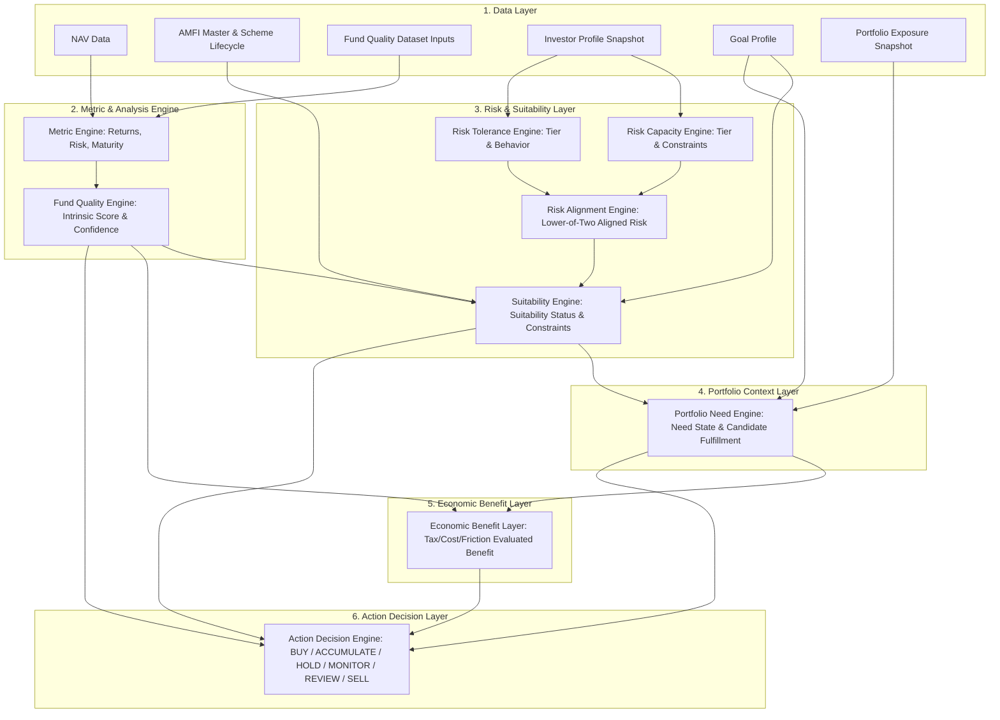
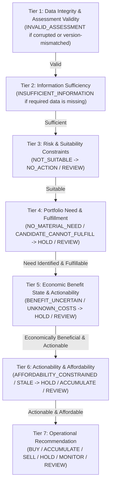
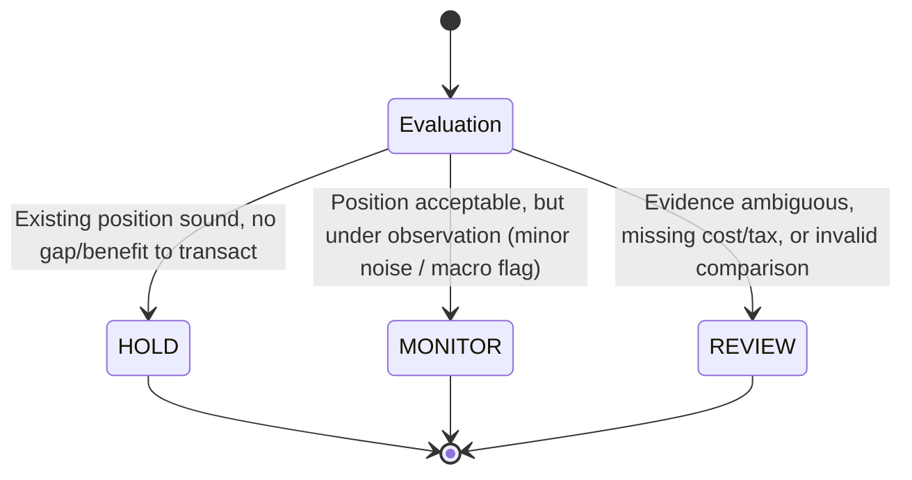
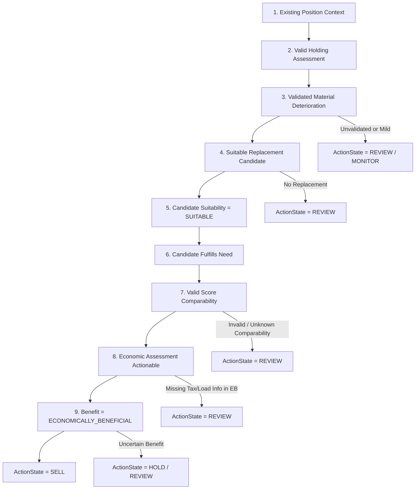
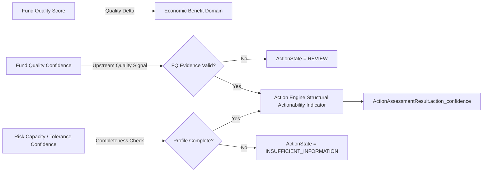
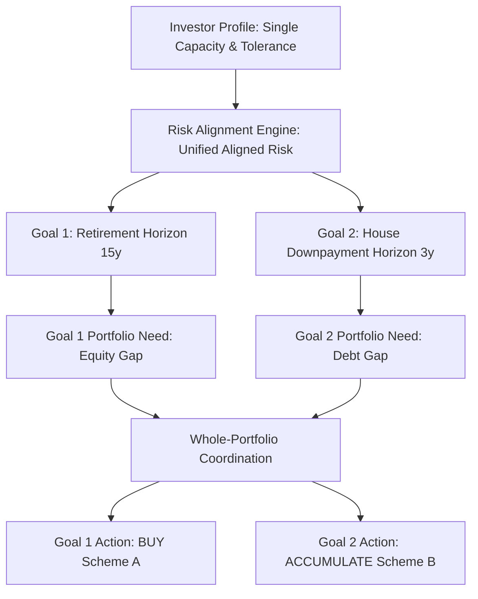
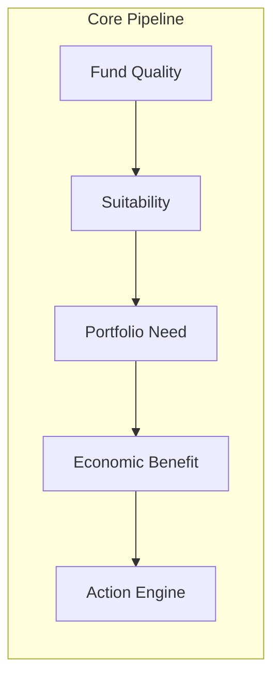

# Phase F.7 — End-to-End Decision Integration Specification
**End-to-End Fund Decision + Portfolio Decision Engine Architecture & Governance**

**Status:** Specification & Governance Only (Phase F.7.1 Governance Correction Applied — No Production Code Created or Modified)  
**Date:** September 2026 UTC  
**Target Engine Architecture:** `mutual-fund-decision-engine` (Phases F.1 through F.7.1)  
**Baseline Test Suite:** 373 passed, 0 failed, 29 warnings  

---

## Core Architectural Invariant
> **ACTION ORCHESTRATES; IT DOES NOT RECREATE UPSTREAM FINANCIAL METHODOLOGY.**  
> The Action Decision Engine is strictly an orchestration and decision-boundary layer. **The Action Engine MUST NOT independently calculate or recreate:**  
> - Fund Quality scoring methodology, normalizations, or numerical confidence thresholds  
> - Risk Capacity financial constraints  
> - Risk Tolerance behavioral scoring  
> - Risk Alignment lower-of-two logic  
> - Suitability rules or horizon matching  
> - Portfolio Need or exposure gap calculations  
> - Economic Benefit return forecasting, net-benefit math, tax liability rules, or exit-load schedules  
>
> Action ONLY consumes governed output results and canonical state contracts emitted by upstream engines.

---

## 0. Pre-Implementation Governance Verification

Before establishing this corrected specification, a forensic audit of the repository was conducted to verify current test state, existing production engine implementation contracts, and previously accepted phase corrections.

### A. Test Suite Baseline
- **Execution Command:** `python -m pytest tests/ -v --tb=short`
- **Result:** `373 passed, 29 warnings in 1.25s`
- **Production Files Modified:** `0` (Zero code files created or mutated in Phase F.7 or Phase F.7.1)

### B. Previously Accepted Phase Corrections Verification
The following accepted phase corrections were confirmed in the codebase:
1. **Phase F.3.4.4 (Suitability):** 5-step decision pipeline (`INVALID_ASSESSMENT > INSUFFICIENT_INFORMATION > HARD_CONSTRAINT > CONDITIONAL_CONCERN > POSITIVE_EVIDENCE`) is strictly enforced in [`risk/suitability_engine.py`](file:///d:/AI%20Portfolio/mutual-fund-decision-engine/risk/suitability_engine.py). Zero weighted scores.
2. **Phase F.4.4 (Portfolio Need):** Explicit separation of Portfolio Need (`NEED_IDENTIFIED`) and Candidate Fulfillment (`CANDIDATE_CAN_FULFILL_NEED`). Engine in [`portfolio/need_engine.py`](file:///d:/AI%20Portfolio/mutual-fund-decision-engine/portfolio/need_engine.py) does not generate transaction actions.
3. **Phase F.5 / F.5.1 / F.5.2 (Economic Benefit):** Canonical vocabulary (`ECONOMICALLY_BENEFICIAL`, `ECONOMICALLY_NOT_BENEFICIAL`, `ECONOMICALLY_NEUTRAL`, `NO_EVALUABLE_CHANGE`, `BENEFIT_UNCERTAIN`, `INSUFFICIENT_INFORMATION`, `INVALID_ASSESSMENT`). Tax/cost rules decoupled from Action. Economic Benefit domain owns all tax, exit-load, and transaction-cost evidence checks.
4. **Phase F.6.3.1 (Action QA Correction):** Action Engine in [`action/engine.py`](file:///d:/AI%20Portfolio/mutual-fund-decision-engine/action/engine.py) consumes canonical F.5 states (`ECONOMICALLY_BENEFICIAL`), enforces `fund_quality_comparison_valid` guardrail for score-based replacements, requires validated deterioration for `SELL`, and defaults to `HOLD` / `REVIEW`.
5. **Phase F.7.1 Correction:** Removal of unvalidated numeric Fund Quality confidence thresholds (`0.70`) from Action and removal of duplicated tax/load/cost checks inside Action. Action consumes upstream governed state contracts exclusively.

---

## 1. End-to-End System Architecture

The end-to-end decision system composes independent, specialized financial engines into a strictly governed, unidirectional processing pipeline.



### Subsystem Decomposition & Boundaries

1. **Risk Subsystem (Investor-Centric & Fund-Centric Context):**
   - `Investor Profile Snapshot -> Risk Capacity -> Risk Tolerance -> Risk Alignment -> Suitability`
   - Governs whether an investor has the financial capacity and psychological tolerance for risk, whether the lower-of-two alignment constraint is respected, and whether a fund's risk profile, horizon, and lock-in are compatible with a specific goal.

2. **Portfolio Subsystem (Goal-Centric Context):**
   - `Goals + Portfolio Holdings + Funding Status + Exposure Gaps -> Portfolio Need`
   - Governs whether a portfolio or goal has an exposure gap or funding gap (`NEED_IDENTIFIED`), and whether a candidate fund can fulfill that specific need (`CANDIDATE_CAN_FULFILL_NEED`).

3. **Economic Benefit Subsystem (Change-Relative Context):**
   - `Portfolio Need + Candidate/Holding + Cost/Tax/Friction Evidence -> Economic Benefit`
   - Governs whether replacing an existing fund or making a new purchase provides net monetary improvement after taxes, exit loads, transaction costs, and friction.
   - **Economic Benefit owns all tax, exit-load, and transaction cost evidence verification.**

4. **Action Decision Subsystem (Operational Decision Layer):**
   - `Suitability Result + Portfolio Need Result + Economic Benefit State + Fund Quality Evidence -> Action Decision`
   - Governs the final decision recommendation (`BUY`, `ACCUMULATE`, `HOLD`, `MONITOR`, `REVIEW`, `SELL`, `NO_ACTION`).

---

## 2. Decision Input Ownership Matrix

To prevent competing logic or fragmented ownership, every decision input in the end-to-end architecture is assigned an explicit owner, producer, consumer, and missing-data boundary rule.

| Input Field Name | Owner Domain | Producer Component | Consumer Component(s) | Required Input? | Unknown Allowed? | Unknown Blocks Action? |
|---|---|---|---|---|---|---|
| `investor_id` | Investor Profile | Profile Service | All Engines | Yes | No | Yes (Blocks All) |
| `profile_version_used` | Investor Profile | Profile Service | All Engines | Yes | No | Yes (Blocks All) |
| `risk_capacity_level` | Risk Capacity | `RiskCapacityEngine` | `RiskAlignmentEngine`, `SuitabilityEngine` | Yes | No | Yes (Forces `INSUFFICIENT_INFORMATION`) |
| `risk_tolerance_level` | Risk Tolerance | `RiskToleranceEngine` | `RiskAlignmentEngine`, `SuitabilityEngine` | Yes | No | Yes (Forces `INSUFFICIENT_INFORMATION`) |
| `aligned_risk_level` | Risk Alignment | `RiskAlignmentEngine` | `SuitabilityEngine` | Yes | No | Yes (Forces `INSUFFICIENT_INFORMATION`) |
| `goal_id` | Goal Domain | Goal Service | `SuitabilityEngine`, `PortfolioNeedEngine` | Optional | Yes | No (Falls back to General Wealth) |
| `goal_horizon_years` | Goal Domain | Goal Service | `SuitabilityEngine`, `PortfolioNeedEngine` | Yes | No | Yes (Forces `INSUFFICIENT_INFORMATION`) |
| `portfolio_exposure_pct` | Portfolio Domain | Portfolio Accounting | `PortfolioNeedEngine`, `SuitabilityEngine` | Optional | Yes | No (Defaults to zero exposure) |
| `funding_status` | Portfolio Domain | `PortfolioNeedEngine` | `ActionEngine` | Yes | Yes | No (Treated as `UNKNOWN_FUNDING`) |
| `candidate_fulfillment` | Portfolio Need | `PortfolioNeedEngine` | `ActionEngine` | Yes | Yes | Yes for BUY/ACCUMULATE (Forces `HOLD`/`REVIEW`) |
| `fund_quality_score` | Fund Quality | `QualityEngine` | `SuitabilityEngine`, `ActionEngine` | Yes | No | Yes for BUY/SELL (Forces `REVIEW`) |
| `fund_quality_evidence_valid` | Fund Quality | `QualityEngine` | `ActionEngine` | Yes | Yes | Yes if invalid (Forces `REVIEW`) |
| `fund_quality_comparison_valid` | Fund Quality | `QualityEngine` (Comparison) | `ActionEngine` | Optional | Yes | Yes for score-based SELL (Forces `REVIEW`) |
| `fund_maturity_months` | Fund Quality | Fund Quality Dataset | `SuitabilityEngine` | Yes | No | Yes if immature (Forces `CONDITIONALLY_SUITABLE`) |
| `raw_riskometer_value` | Fund Registry | SEBI / AMFI Feed | `SuitabilityEngine` | Yes | No | Yes (Forces `INSUFFICIENT_INFORMATION`) |
| `suitability_status` | Suitability | `SuitabilityEngine` | `PortfolioNeedEngine`, `ActionEngine` | Yes | No | Yes (If not `SUITABLE`, blocks BUY/ACCUMULATE/SELL) |
| `portfolio_need_state` | Portfolio Need | `PortfolioNeedEngine` | `ActionEngine` | Yes | No | Yes (If not `NEED_IDENTIFIED`, blocks BUY/ACCUMULATE) |
| `affordability_status` | Portfolio Need | `PortfolioNeedEngine` | `ActionEngine` | Yes | Yes | Yes for BUY (If constrained, forces `HOLD`/`ACCUMULATE`) |
| `economic_benefit_state` | Economic Benefit | `EconomicBenefitEngine` | `ActionEngine` | Yes | Yes | Yes for BUY/SELL (Must be `ECONOMICALLY_BENEFICIAL`) |
| `economic_benefit_actionable` | Economic Benefit | `EconomicBenefitEngine` | `ActionEngine` | Yes | Yes | Yes (If False due to missing tax/cost info, forces `REVIEW`) |
| `expected_improvement` | Economic Benefit | `EconomicBenefitEngine` | `ActionEngine` | Optional | Yes | No (Emitted as qualitative benefit reference) |
| `deterioration_signal` | Fund Quality | `QualityEngine` (Deterioration) | `ActionEngine` | Optional | Yes | Yes for SELL (Must be `MATERIAL_DETERIORATION`) |
| `deterioration_validated` | Fund Quality | Quality Governance | `ActionEngine` | Yes | Yes | Yes for SELL (Unvalidated signal forces `REVIEW`) |
| `action_state` | Action Domain | `ActionEngine` | Downstream Advisory / UI | Output | N/A | N/A |
| `provenance` | Governance | All Upstream Engines | Audit Log & `ActionAssessmentResult` | Yes | No | Yes (Missing provenance forces `INVALID_ASSESSMENT`) |
| `methodology_version` | Governance | System Registry | All Assessment Results | Yes | No | Yes (Version mismatch forces `INVALID_ASSESSMENT`) |
| `rule_version` | Governance | System Registry | All Assessment Results | Yes | No | Yes (Rule mismatch forces `INVALID_ASSESSMENT`) |

---

## 3. End-to-End Decision Precedence Hierarchy

The end-to-end pipeline operates under a strict, non-negotiable 7-tier precedence hierarchy. Downstream recommendation logic is evaluated **only** when all higher-tier prerequisites pass without violation.



### Precedence Rules Enforcement
1. **Zero Weighted Composite Scores Across Domains:** Risk Capacity, Risk Tolerance, Fund Quality, Portfolio Need, and Economic Benefit are NEVER summed, averaged, or combined into a single composite score.
2. **Hard Short-Circuiting:** An invalid or unsuitable upstream state cannot be compensated by an exceptionally high score in another domain.
   - *Example:* A Fund Quality score of 95/100 CANNOT override an investor Risk Capacity constraint or an unsuitable risk-o-meter rating.
   - *Example:* A strong Portfolio Need CANNOT override an uncertain Economic Benefit state or missing tax liability data.

---

## 4. Governed BUY Decision Chain

A `BUY` recommendation represents an authorization to open a new position in a candidate fund. Under approved F.7.1 governance, it requires unanimous satisfaction of 9 governed upstream prerequisites **without Action inventing numerical thresholds or duplicating tax/cost checks**.

```mermaid
flowchart LR
    P1[1. Valid Profile] --> P2[2. Valid Risk Alignment]
    P2 --> P3[3. Suitability Permits Candidate]
    P3 --> P4[4. Need = NEED_IDENTIFIED]
    P4 --> P5[5. Fulfillment = CAN_FULFILL]
    P5 --> P6[6. Quality Evidence Valid]
    P6 --> P7[7. Economic Assessment Actionable]
    P7 --> P8[8. Benefit = ECONOMICALLY_BENEFICIAL]
    P8 --> P9[9. Actionable & Affordable]
    P9 --> BUY[ActionState = BUY]
```



### Mandatory Governed BUY Checklist
1. **Investor Context Valid:** Investor profile snapshot is active, complete, and non-stale.
2. **Risk Assessment Valid:** Risk Capacity, Risk Tolerance, and Risk Alignment assessments are valid (`FULLY_ALIGNED` or governed constraint).
3. **Suitability Result:** Candidate fund Suitability Status explicitly permits entry (`SUITABLE` or governed permitted state).
4. **Portfolio Need State:** Portfolio Need assessment is explicitly `NEED_IDENTIFIED`.
5. **Candidate Fulfillment Status:** Candidate Fulfillment Status is explicitly `CANDIDATE_CAN_FULFILL_NEED`.
6. **Fund Quality Assessment Valid:** Candidate Fund Quality assessment and underlying evidence validity contract are satisfied as emitted by Fund Quality (`fund_quality_evidence_valid == True`). **Action DOES NOT enforce a numeric confidence threshold (e.g. 0.70).**
7. **Economic Benefit Assessment Actionable:** Economic Benefit assessment is valid, complete, and actionable according to its upstream contract (`economic_benefit_actionable == True`). **Action DOES NOT independently verify tax/load/cost flags.**
8. **Canonical Economic Benefit:** Economic Benefit state is explicitly the canonical F.5 positive state `ECONOMICALLY_BENEFICIAL`.
9. **Actionability & Affordability:** Affordability status is `AFFORDABLE` (or `AFFORDABILITY_STATUS_UNKNOWN` in unconstrained mode), and input freshness is non-stale (`is_stale_input == False`).

---

## 5. Governed ACCUMULATE Decision Chain

An `ACCUMULATE` recommendation represents an authorization to increase allocation to an existing, suitable holding. It is structurally distinct from `BUY`.

### Distinction Between BUY and ACCUMULATE

| Feature | BUY Decision Chain | ACCUMULATE Decision Chain |
|---|---|---|
| **Position Context** | `NEW_POSITION` | `EXISTING_POSITION` |
| **Primary Target** | Candidate fund for initial entry | Currently held scheme in portfolio |
| **Suitability Target** | Candidate scheme suitability | Existing holding scheme suitability |
| **Need Justification** | New exposure gap or new goal allocation | Ongoing goal funding gap or target rebalancing |
| **Constrained Fallback** | `NO_ACTION` or `REVIEW` | Partial accumulation or `HOLD` |

### Mandatory ACCUMULATE Checklist
1. **Existing Position Context:** `position_context == PositionContext.EXISTING_POSITION`.
2. **Holding Suitability:** Existing holding Suitability Status is explicitly `SUITABLE`.
3. **Justified Ongoing Need:** Goal funding gap exists (`UNDERFUNDED` or `PARTIALLY_FUNDED`) or exposure gap is positive (`POSITIVE_GAP`).
4. **Candidate Fulfillment:** Candidate scheme (or existing holding) can fulfill ongoing need (`CANDIDATE_CAN_FULFILL_NEED`).
5. **Economic Benefit:** Economic Benefit state is canonical `ECONOMICALLY_BENEFICIAL` and actionable.
6. **Affordability Limits:** If `affordability_status == AFFORDABILITY_CONSTRAINED`, accumulation is capped to sustainable SIP/cash surplus limits; if surplus is zero, falls back to `HOLD`.

---

## 6. HOLD / MONITOR / REVIEW Semantics

Non-transactional outputs form the operational foundation of the anti-churn architecture. They are strictly differentiated based on evidence sufficiency and change significance.



### Operational State Definitions

#### 1. HOLD (Default Operational State)
- **Meaning:** The existing position remains acceptable and aligned with investor goals. No portfolio change or transaction is currently justified.
- **Triggers:**
  - Portfolio Need = `NO_MATERIAL_NEED`
  - Position Context = `EXISTING_POSITION` with sound Fund Quality and Suitability
  - Proposed switch yields `ECONOMICALLY_NEUTRAL` or `ECONOMICALLY_NOT_BENEFICIAL` result

#### 2. MONITOR (Observation & Signal Tracking)
- **Meaning:** No transaction is currently justified, but specific metrics or conditions warrant active automated monitoring across cycles.
- **Triggers:**
  - Mild, unvalidated underperformance signal (`deterioration_signal == "TEMPORARY_UNDERPERFORMANCE"`)
  - Macro stress flag active (`macro_stress_flag == True`) without validated fund deterioration
  - Goal horizon approaching transition threshold (e.g., entering lock-in window)

#### 3. REVIEW (Human / Advisory Reassessment Required)
- **Meaning:** Upstream evidence or circumstances warrant manual advisory or analyst review. **REVIEW NEVER automatically authorizes a transaction.**
- **Triggers:**
  - Material deterioration detected but no suitable replacement candidate exists (`NO_SUITABLE_REPLACEMENT`)
  - Candidate Fund Quality comparison is invalid or unknown (`fund_quality_comparison_valid is not True`)
  - Deterioration signal is unvalidated by governed methodology (`deterioration_validated == False`)
  - Upstream Economic Benefit assessment reports missing/uncertain tax, exit load, or transaction cost data (`economic_benefit_actionable == False`)
  - Conflict between goal priority and affordability constraint

---

## 7. Governed SELL Decision Chain

A `SELL` recommendation authorizes the liquidation of an existing position. Because selling incurs realized capital gains taxes, exit loads, transaction friction, and market out-of-money risks, the `SELL` chain is designed under strict anti-churn conservatism **without Action independently calculating tax, load, or cost math**.



### Mandatory 10-Point Governed SELL Checklist
1. **Existing Position Required:** `position_context == PositionContext.EXISTING_POSITION`.
2. **Valid Holding Assessment:** Holding scheme is identified, active, and assessed.
3. **Validated Material Deterioration:** `deterioration_signal == "MATERIAL_DETERIORATION"` AND `deterioration_validated == True`.
4. **Suitable Replacement Candidate Identified:** `has_suitable_replacement == True`.
5. **Replacement Candidate Suitability:** Replacement scheme Suitability Status is `SUITABLE`.
6. **Candidate Fulfillment:** Replacement candidate can fulfill goal/portfolio need (`CANDIDATE_CAN_FULFILL_NEED` where portfolio need is relevant).
7. **Valid Fund Quality Score Comparability:** `fund_quality_comparison_valid == True` (governed by Fund Quality domain).
8. **Economic Benefit Assessment Actionable:** Economic Benefit assessment is valid, complete, and actionable (`economic_benefit_actionable == True`). **Action DOES NOT calculate tax liability, exit load, transaction cost, expected return improvement, or switching benefit.**
9. **Canonical Economic Benefit:** Economic Benefit state is explicitly canonical `ECONOMICALLY_BENEFICIAL`.
10. **Actionability & Evidence Sufficiency:** Action-level evidence sufficiency requirements are satisfied.

### Prohibited SELL Triggers (Guardrails)
- **Lower Fund Quality Score Alone:** A lower candidate or holding score alone MUST NEVER trigger SELL.
- **Short-Term Underperformance Alone:** Unvalidated or short-term underperformance MUST NEVER trigger SELL.
- **Macro Conditions Alone:** Macroeconomic stress flags or market volatility MUST NEVER trigger SELL.
- **Missing Tax / Cost Evidence:** Missing tax liability or exit load data in Economic Benefit MUST NEVER silently permit SELL (forces `REVIEW`).
- **Invalid Score Comparability:** Comparing scores across different categories or methodology versions MUST NEVER trigger SELL (forces `REVIEW`).

---

## 8. No-Action / No-Change Operational Semantics

To prevent generic "NO" outputs, the system maintains strict operational semantics for canonical non-actionable states:

| Canonical Upstream State Tag | Operational Meaning | System Action | Primary Reason Code |
|---|---|---|---|
| `NO_PORTFOLIO_NEED` | Goal is adequately funded; exposure is within target band. | Return `ActionState.HOLD` | `NO_PORTFOLIO_NEED` |
| `NO_EVALUABLE_CHANGE` | Proposed switch results in zero evaluable change in quality or exposure. | Return `ActionState.HOLD` | `SWITCH_NOT_JUSTIFIED` |
| `ECONOMICALLY_NOT_BENEFICIAL` | Switch generates negative net economic value after tax/costs. | Return `ActionState.HOLD` | `SWITCH_NOT_JUSTIFIED` |
| `ECONOMICALLY_NEUTRAL` | Switch yields zero net financial benefit after friction. | Return `ActionState.HOLD` | `HOLD_DEFAULT` |
| `BENEFIT_UNCERTAIN` | Economic improvement cannot be established with confidence. | Return `ActionState.HOLD` / `REVIEW` | `ECONOMIC_BENEFIT_UNKNOWN` |
| `INSUFFICIENT_INFORMATION` | Required upstream evidence (risk, quality, costs) is missing. | Return `ActionState.INSUFFICIENT_INFORMATION` | `INSUFFICIENT_EVIDENCE` |
| `INVALID_ASSESSMENT` | Upstream assessment payload is corrupted or version-mismatched. | Return `ActionState.INVALID_ASSESSMENT` | `INVALID_INPUT` |

> **TAXONOMY CONSTRAINTS:**  
> Action MUST NOT invent parallel economic taxonomies such as `HIGH_BENEFIT`, `MODERATE_BENEFIT`, `LOW_BENEFIT`, or `ACTION_BENEFICIAL`. Action consumes only the canonical F.5 states above.

---

## 9. Clarified Confidence Semantics & Construct Separation

The system enforces strict construct separation across all five evaluation domains. Confidence metrics are **never** combined into a single universal composite confidence score, nor are they converted into statistical return probabilities.

$$\text{Fund Quality Score} \neq \text{Fund Quality Confidence} \neq \text{Suitability} \neq \text{Risk Alignment} \neq \text{Portfolio Need} \neq \text{Economic Benefit} \neq \text{Actionability}$$



### Clarified Confidence Rules
1. **Fund Quality Score:** Represents intrinsic scheme quality relative to category peers.
2. **Fund Quality Confidence:** Represents data completeness of underlying scheme NAV, metrics, and peer group data (0.0 to 1.0). It remains an upstream evidence signal. **Action DOES NOT enforce a numeric cutoff (e.g. 0.70).** If upstream FQ flags evidence as invalid, Action consumes that upstream state and forces `REVIEW`.
3. **Actionability Indicator (`action_confidence`):** Emitted on `ActionAssessmentResult` to reflect structural input completeness (1.0 = fully sufficient, 0.5-0.8 = constrained/partial, 0.0 = insufficient). **It is NOT a statistical probability of return, does NOT claim empirical calibration, and is NOT used as a numerical cutoff to filter recommendations.**

---

## 10. Forensic Audit of Integration Layer Methodology

A forensic audit of the Phase F.7 specification was conducted to verify that zero domain methodology was accidentally duplicated inside the Action / Integration layer.

| Financial / Architectural Construct | Domain Owner | Action Engine Role | Duplication Check Result |
|---|---|---|---|
| **Fund Quality Score & Normalizations** | Fund Quality Domain (`QualityEngine`) | Consumes `fund_quality_score` | **PASSED (Zero score math in Action)** |
| **Fund Quality Confidence Thresholds** | Fund Quality Domain (`QualityEngine`) | Consumes `fund_quality_evidence_valid` | **PASSED (Numeric 0.70 cutoff removed)** |
| **Risk Capacity Constraints** | Risk Capacity Domain (`RiskCapacityEngine`) | Consumes `risk_capacity_level` | **PASSED (Zero capacity ratio math in Action)** |
| **Risk Tolerance Scoring** | Risk Tolerance Domain (`RiskToleranceEngine`) | Consumes `risk_tolerance_level` | **PASSED (Zero questionnaire math in Action)** |
| **Risk Alignment Lower-of-Two** | Risk Alignment Domain (`RiskAlignmentEngine`) | Consumes `aligned_risk_level` | **PASSED (Zero alignment math in Action)** |
| **Suitability Rules & Horizon Matching** | Suitability Domain (`SuitabilityEngine`) | Consumes `suitability_status` | **PASSED (Zero horizon matching in Action)** |
| **Portfolio Need & Exposure Gaps** | Portfolio Need Domain (`PortfolioNeedEngine`) | Consumes `portfolio_need_state` | **PASSED (Zero exposure gap math in Action)** |
| **Candidate Fulfillment** | Portfolio Need Domain (`PortfolioNeedEngine`) | Consumes `candidate_fulfillment` | **PASSED (Zero fulfillment math in Action)** |
| **Tax Liability Rules & Cutoffs** | Economic Benefit Domain (`EconomicBenefitEngine`) | Consumes `economic_benefit_actionable` | **PASSED (Zero tax rate math in Action)** |
| **Exit Load Schedules & Calculations** | Economic Benefit Domain (`EconomicBenefitEngine`) | Consumes `economic_benefit_actionable` | **PASSED (Zero exit load math in Action)** |
| **Transaction Cost & Friction Math** | Economic Benefit Domain (`EconomicBenefitEngine`) | Consumes `economic_benefit_actionable` | **PASSED (Zero transaction cost math in Action)** |
| **Expected Improvement & Net Benefit** | Economic Benefit Domain (`EconomicBenefitEngine`) | Consumes `economic_benefit_state` | **PASSED (Zero return delta math in Action)** |
| **Portfolio Concentration Limits** | Suitability / Portfolio Need Domains | Consumes concentration status | **PASSED (Zero concentration math in Action)** |
| **Macro Stress Indicators** | Market Regime / Quality Domains | Consumes `macro_stress_flag` | **PASSED (Zero macro indicator math in Action)** |

---

## 11. Data Missingness & Unknown Handling

When inputs are missing, incomplete, or corrupted, the system enforces safe, conservative behavior without optimistic defaults.

| Input Domain | Data Condition | Engine Behavior | Resulting Action Output |
|---|---|---|---|
| **Investor Profile** | Missing income/expenses | `RiskCapacityEngine` marks status `INSUFFICIENT_INFORMATION` | `ActionState.INSUFFICIENT_INFORMATION` |
| **Risk Tolerance** | Unanswered questionnaire | `RiskToleranceEngine` marks status `INSUFFICIENT_INFORMATION` | `ActionState.INSUFFICIENT_INFORMATION` |
| **Risk Alignment** | Stale risk snapshot (>180 days) | `RiskAlignmentEngine` sets `is_stale_input = True` | `ActionState.HOLD` or `REVIEW` |
| **Fund Quality** | Immature scheme (<36 months) | `SuitabilityEngine` flags `immature_fund` constraint | `ActionState.REVIEW` or `CONDITIONALLY_SUITABLE` |
| **Fund Quality** | Missing benchmark / peer group | `QualityEngine` sets `fund_quality_evidence_valid = False` | `ActionState.REVIEW` |
| **Tax / Costs** | Missing capital gains tax rate | `EconomicBenefitEngine` sets `economic_benefit_actionable = False` | `ActionState.REVIEW` (Reason: `TAX_COST_INFORMATION_MISSING`) |
| **Exit Load** | Unknown exit load schedule | `EconomicBenefitEngine` sets `economic_benefit_actionable = False` | `ActionState.REVIEW` (Reason: `EXIT_LOAD_INFORMATION_MISSING`) |
| **Score Comparability** | Different category/plan/version | `QualityEngine` sets `fund_quality_comparison_valid = False` | `ActionState.REVIEW` (Blocks SELL replacement) |

> **CRITICAL INVARIANT:** Missing data MUST NEVER silently default to zero cost, zero tax, mature fund status, full suitability, or positive economic benefit.

---

## 12. Version and Provenance Propagation

Every final `ActionAssessmentResult` preserves full cryptographic and historical provenance connecting the recommendation to the exact point-in-time evidence and methodology versions that generated it.

```json
{
  "assessment_id": "act_8f9a2b3c-4d5e-6f7a-8b9c-0d1e2f3a4b5c",
  "investor_id": "inv_12345678",
  "scheme_id": "INF209K01157",
  "position_context": "EXISTING_POSITION",
  "action_state": "REVIEW",
  "information_sufficiency": "SUFFICIENT",
  "actionability_status": "HIGH_ACTIONABILITY",
  "action_confidence": 1.0,
  "primary_reason_code": "TAX_COST_INFORMATION_MISSING",
  "reason_codes": [
    "TAX_COST_INFORMATION_MISSING",
    "MATERIAL_REVIEW_SIGNAL"
  ],
  "upstream_assessment_ids": {
    "risk_capacity_id": "rc_10293847",
    "risk_tolerance_id": "rt_56473829",
    "risk_alignment_id": "ra_99887766",
    "suitability_id": "suit_11223344",
    "portfolio_need_id": "pneed_55667788",
    "fund_quality_id": "fq_44332211",
    "economic_benefit_id": "eb_12344321"
  },
  "observation_timestamp": "2026-09-12T19:47:00Z",
  "methodology_version": "F.6.2",
  "rule_version": "1.0.0"
}
```

---

## 13. Fund Quality Score Comparability Governance

To prevent improper score comparisons (e.g., comparing a Mid Cap Equity fund score against a Liquid Debt fund score, or comparing Direct Plan vs Regular Plan), score comparison is strictly governed.

### Comparability Criteria
Two Fund Quality scores are comparable **only** when all six comparison context parameters match:
1. **Same SEBI Category:** (e.g., `Equity` == `Equity`)
2. **Same Subcategory:** (e.g., `Large Cap` == `Large Cap`)
3. **Same Plan Type:** (e.g., `Direct` == `Direct`)
4. **Same Option Type:** (e.g., `Growth` == `Growth`)
5. **Same Scoring Methodology Version:** (e.g., `E.1.0` == `E.1.0`)
6. **Same Configuration Version:** (e.g., `1.0.0` == `1.0.0`)

### Action Consumption Rule
- The Action Decision Engine consumes `fund_quality_comparison_valid: Optional[bool]` supplied by the upstream Fund Quality domain.
- **Action DOES NOT calculate score comparability.**
- If `fund_quality_comparison_valid` is `False` or `None`, candidate score comparison MUST NOT support position liquidation (`SELL`). The engine falls back to `REVIEW`.

---

## 14. Multi-Goal and Whole-Portfolio Interaction

The system handles multi-goal portfolios without double-counting or cross-goal pollution.



### Multi-Goal Governance Rules
1. **Investor Identity:** Single investor profile snapshot yields unified Risk Capacity and Risk Tolerance.
2. **Goal Isolation:** Each goal maintains an independent `GoalProfile` (target amount, target date, horizon, priority).
3. **Suitability per Goal:** Suitability is evaluated for `(Investor, Scheme, Goal)`. A fund suitable for Goal 1 (Retirement, 15y) may be `NOT_SUITABLE` for Goal 2 (Emergency Fund, 1y).
4. **Whole-Portfolio Coordination:** Whole-portfolio asset allocation prevents cumulative over-concentration across goals.

---

## 15. Macroeconomic Input Boundary

Macroeconomic context (e.g., interest rate regimes, market valuation stress indicators) is strictly bounded to prevent unvalidated market-timing algorithms.

```
[Allowed Macro Inputs]
- Market Regime Classification (High Volatility, Rate Hike Cycle) -> Context for Fund Quality Normalization
- Category Stress Flags -> Triggers Portfolio Concentration Alerts
- Liquidity Stress Warnings -> Increases Liquidity Friction Buffer in Economic Benefit

[PROHIBITED Macro Inputs]
- Macro signals CANNOT independently trigger BUY
- Macro signals CANNOT independently trigger SELL
- Macro signals CANNOT override Fund Quality scores or Suitability results
- Macro signals CANNOT execute tactical market-timing asset allocation switches
```

---

## 16. Turnover Governance & Anti-Churn Invariants

The architecture enforces a strict low-turnover principle to protect investors from unnecessary transaction costs, taxes, and behavioral churn.

### Core Turnover Principle
> **DEFAULT STATE = DO NOTHING (`HOLD` / `MONITOR`).**  
> A recommendation to transact (`BUY`, `ACCUMULATE`, `SELL`) requires a significantly higher burden of proof than a recommendation to hold an existing position.

### Anti-Churn Hierarchy
```
HOLD / MONITOR (Lowest Friction Boundary)
  └─> REVIEW (Requires Advisory Verification)
        └─> ACCUMULATE / BUY (Requires Validated Need & Economic Benefit)
              └─> SELL (Highest Friction Boundary — Requires Validated Deterioration, Replacement, & Positive Net Benefit)
```

---

## 17. Forensic Circular Dependency Audit

A forensic audit of component interactions was conducted across all six decision layers. The system is verified 100% acyclic.



### Dependency Audit Findings

| Cycle Checked | Direction | Status | Verification Detail |
|---|---|---|---|
| `Fund Quality <-> Suitability` | Unidirectional (`FQ -> Suitability`) | **PASSED (No Cycle)** | `SuitabilityEngine` consumes `FundQualityScoreResult`. FQ engine has zero dependency on Suitability. |
| `Portfolio Need <-> Economic Benefit` | Unidirectional (`Need -> Benefit`) | **PASSED (No Cycle)** | `EconomicBenefitEngine` consumes `PortfolioNeedAssessmentResult`. Need engine has zero dependency on Benefit. |
| `Economic Benefit <-> Fund Quality` | Unidirectional (`FQ -> Benefit`) | **PASSED (No Cycle)** | Economic Benefit consumes scheme quality delta. FQ engine has zero dependency on Benefit. |
| `Action Engine <-> Upstream` | Strictly Downstream | **PASSED (No Cycle)** | `ActionEngine` consumes upstream results. Zero upstream engines call Action. |
| `Risk Tolerance <-> Fund Quality` | Completely Independent | **PASSED (No Cycle)** | Behavioral questionnaire scoring has zero dependency on fund metrics or NAV. |
| `Portfolio Concentration <-> Fund Quality` | Completely Independent | **PASSED (No Cycle)** | Portfolio concentration is portfolio context; FQ is intrinsic scheme quality. |

---

## 18. End-to-End System Failure Matrix

The system specifies explicit, safe failure outcomes for all potential system failure modes across input, execution, and environment boundaries.

| Failure Mode / Scenario | Upstream Error State | System Output (`ActionState`) | Primary Reason Code | Secondary Reason Codes |
|---|---|---|---|---|
| **Missing Investor Profile** | Profile snapshot null/empty | `INSUFFICIENT_INFORMATION` | `INSUFFICIENT_INPUT` | `INVALID_INPUT` |
| **Invalid Risk Capacity** | Income/expense data corrupted | `INSUFFICIENT_INFORMATION` | `INSUFFICIENT_EVIDENCE` | `INVALID_INPUT` |
| **Invalid Risk Tolerance** | Questionnaire invalid/unscored | `INSUFFICIENT_INFORMATION` | `INSUFFICIENT_EVIDENCE` | `INVALID_INPUT` |
| **Stale Risk Snapshot** | Snapshot date > 180 days | `HOLD` or `REVIEW` | `STALE_INPUT` | `MATERIAL_REVIEW_SIGNAL` |
| **Unsuitable Fund** | Suitability = `NOT_SUITABLE` | `NO_ACTION` / `REVIEW` | `CANDIDATE_NOT_SUITABLE` | `CANDIDATE_NOT_SUITABLE` |
| **Missing Goal** | Goal profile unattached | `HOLD` (General Wealth Mode) | `HOLD_DEFAULT` | None |
| **No Portfolio Need** | Need = `NO_MATERIAL_NEED` | `HOLD` | `NO_PORTFOLIO_NEED` | `HOLD_DEFAULT` |
| **Candidate Cannot Fulfill** | Fulfillment = `CANNOT_FULFILL` | `HOLD` / `REVIEW` | `CANDIDATE_CANNOT_FULFILL_NEED` | `SWITCH_NOT_JUSTIFIED` |
| **Unknown Fulfillment** | Fulfillment = `UNKNOWN` | `HOLD` / `REVIEW` | `CANDIDATE_FULFILLMENT_UNKNOWN` | `INSUFFICIENT_EVIDENCE` |
| **Missing Fund Quality** | Scheme un-scored in FQ | `REVIEW` | `INSUFFICIENT_EVIDENCE` | `MATERIAL_REVIEW_SIGNAL` |
| **Invalid FQ Evidence** | `fund_quality_evidence_valid=False` | `REVIEW` | `INSUFFICIENT_EVIDENCE` | `LOW_ACTIONABILITY` |
| **Invalid FQ Comparison** | Category/version mismatch | `REVIEW` | `INSUFFICIENT_EVIDENCE` | `SWITCH_NOT_JUSTIFIED` |
| **Missing Tax Evidence in EB** | `economic_benefit_actionable=False` | `REVIEW` | `TAX_COST_INFORMATION_MISSING` | `MATERIAL_REVIEW_SIGNAL` |
| **Missing Exit Load in EB** | `economic_benefit_actionable=False` | `REVIEW` | `EXIT_LOAD_INFORMATION_MISSING` | `MATERIAL_REVIEW_SIGNAL` |
| **Uncertain Economic Benefit** | Benefit state = `BENEFIT_UNCERTAIN` | `HOLD` / `REVIEW` | `ECONOMIC_BENEFIT_UNKNOWN` | `HOLD_DEFAULT` |
| **Unvalidated Deterioration** | Signal present but `validated=False` | `REVIEW` | `UNVALIDATED_DETERIORATION` | `MATERIAL_REVIEW_SIGNAL` |
| **No Replacement Available** | `has_suitable_replacement=False` | `REVIEW` | `NO_SUITABLE_REPLACEMENT` | `MATERIAL_REVIEW_SIGNAL` |
| **Invalid Provenance** | Provenance metadata missing | `INVALID_ASSESSMENT` | `INVALID_INPUT` | `INSUFFICIENT_INPUT` |
| **Methodology Mismatch** | Version conflict across modules | `INVALID_ASSESSMENT` | `INVALID_INPUT` | `STALE_INPUT` |

---

## 19. Corrected End-to-End Test Strategy (Specification Only)

To prepare for future integration testing, a comprehensive test plan containing 21 test scenarios (Test A through Test U) is defined under approved F.7.1 governance rules.

### Integration Test Suite Matrix

```
[TEST A: Governed BUY Integration]
- Inputs: Complete Profile, Aligned Risk High, Suitability = SUITABLE, Need = NEED_IDENTIFIED, Candidate Fulfills = True, FQ Evidence Valid = True (No numeric threshold in Action), Economic Benefit Actionable = True, Benefit = ECONOMICALLY_BENEFICIAL, Affordable = True.
- Expected Output: ActionState.BUY, Primary Reason: NEED_IDENTIFIED, action_confidence: 1.0.

[TEST B: Governed ACCUMULATE Integration]
- Inputs: PositionContext = EXISTING_POSITION, Suitable Holding = True, Positive Exposure Gap = True, Benefit = ECONOMICALLY_BENEFICIAL, Affordable = True.
- Expected Output: ActionState.ACCUMULATE, Primary Reason: POSITIVE_PORTFOLIO_NEED.

[TEST C: HOLD Default Integration]
- Inputs: PositionContext = EXISTING_POSITION, Suitable Holding = True, Need = NO_MATERIAL_NEED.
- Expected Output: ActionState.HOLD, Primary Reason: NO_PORTFOLIO_NEED.

[TEST D: MONITOR Underperformance Integration]
- Inputs: PositionContext = EXISTING_POSITION, Suitable Holding = True, deterioration_signal = TEMPORARY_UNDERPERFORMANCE.
- Expected Output: ActionState.MONITOR, Primary Reason: TEMPORARY_UNDERPERFORMANCE.

[TEST E: REVIEW Unvalidated Deterioration Integration]
- Inputs: PositionContext = EXISTING_POSITION, deterioration_signal = MATERIAL_DETERIORATION, deterioration_validated = False.
- Expected Output: ActionState.REVIEW, Primary Reason: UNVALIDATED_DETERIORATION.

[TEST F: Governed SELL & Replace Integration]
- Inputs: PositionContext = EXISTING_POSITION, deterioration_signal = MATERIAL_DETERIORATION, deterioration_validated = True, has_suitable_replacement = True, Candidate Suitability = SUITABLE, Candidate Fulfills = True, FQ Comparison Valid = True, Economic Benefit Actionable = True, Benefit = ECONOMICALLY_BENEFICIAL.
- Expected Output: ActionState.SELL, Primary Reason: MATERIAL_REVIEW_SIGNAL.

[TEST G: Missing Investor Data Integration]
- Inputs: Investor profile income/expense missing.
- Expected Output: ActionState.INSUFFICIENT_INFORMATION, Primary Reason: INSUFFICIENT_INPUT.

[TEST H: Invalid Risk Capacity Integration]
- Inputs: Debt-to-Income ratio corrupted/negative.
- Expected Output: ActionState.INSUFFICIENT_INFORMATION, Primary Reason: INSUFFICIENT_EVIDENCE.

[TEST I: Unsuitable Candidate BUY Block]
- Inputs: Need = NEED_IDENTIFIED, Candidate Suitability = NOT_SUITABLE, Benefit = ECONOMICALLY_BENEFICIAL.
- Expected Output: ActionState.NO_ACTION / REVIEW, Primary Reason: CANDIDATE_NOT_SUITABLE.

[TEST J: Candidate Cannot Fulfill Need Block]
- Inputs: Need = NEED_IDENTIFIED, Candidate Suitability = SUITABLE, Candidate Fulfillment = CANNOT_FULFILL.
- Expected Output: ActionState.HOLD / REVIEW, Primary Reason: CANDIDATE_CANNOT_FULFILL_NEED.

[TEST K: Non-Comparable Fund Quality Scores SELL Block]
- Inputs: PositionContext = EXISTING_POSITION, Material Deterioration = True, Replacement Available = True, Candidate FQ Comparison Valid = False.
- Expected Output: ActionState.REVIEW, Primary Reason: INSUFFICIENT_EVIDENCE.

[TEST L: Economic Benefit Uncertainty BUY Block]
- Inputs: Need = NEED_IDENTIFIED, Candidate Suitability = SUITABLE, Candidate Fulfills = True, Economic Benefit = BENEFIT_UNCERTAIN.
- Expected Output: ActionState.HOLD / REVIEW, Primary Reason: ECONOMIC_BENEFIT_UNKNOWN.

[TEST M: Unactionable Economic Benefit SELL Block]
- Inputs: PositionContext = EXISTING_POSITION, Material Deterioration = True, Replacement Available = True, economic_benefit_actionable = False (due to missing tax/cost in EB).
- Expected Output: ActionState.REVIEW, Primary Reason: TAX_COST_INFORMATION_MISSING.

[TEST N: Multi-Goal Conflict Resolution]
- Inputs: Single Investor, Goal 1 (Retirement 15y) BUY Scheme A, Goal 2 (House 2y) Scheme A NOT_SUITABLE.
- Expected Output: Goal 1 Action = BUY, Goal 2 Action = NO_ACTION / REVIEW (Independent Goal Isolation).

[TEST O: Portfolio-Level vs Candidate-Level Need Alignment]
- Inputs: Portfolio Need = NEED_IDENTIFIED (Equity Gap), Candidate = Debt Scheme.
- Expected Output: Candidate Fulfillment = CANNOT_FULFILL, ActionState = HOLD / REVIEW.

[TEST P: Macro Stress Context Guardrail]
- Inputs: macro_stress_flag = True, zero material fund deterioration.
- Expected Output: ActionState.MONITOR, Primary Reason: MACRO_STRESS_CONTEXT.

[TEST Q: Upstream Invalid FQ Evidence Guardrail]
- Inputs: Candidate fund_quality_evidence_valid = False (Upstream FQ data incomplete).
- Expected Output: ActionState.REVIEW, Primary Reason: INSUFFICIENT_EVIDENCE.

[TEST R: Stale Risk Snapshot Guardrail]
- Inputs: Risk Alignment snapshot date > 180 days ago.
- Expected Output: ActionState.HOLD / REVIEW, Primary Reason: STALE_INPUT.

[TEST S: Construct Isolation Verification]
- Inputs: Candidate FQ Score = 98/100, Suitability = NOT_SUITABLE.
- Expected Output: ActionState.NO_ACTION / REVIEW, Primary Reason: CANDIDATE_NOT_SUITABLE (High score cannot override suitability).

[TEST T: Provenance & Version Mismatch Guardrail]
- Inputs: Upstream Suitability methodology_version = "0.9.0" (Mismatch with 1.0.0).
- Expected Output: ActionState.INVALID_ASSESSMENT, Primary Reason: INVALID_INPUT.

[TEST U: Anti-Churn Economic Gate Guardrail]
- Inputs: Candidate FQ Score = 85 vs Holding FQ Score = 82, Switch Net Benefit after tax/costs = 0.0 (ECONOMICALLY_NEUTRAL).
- Expected Output: ActionState.HOLD, Primary Reason: HOLD_DEFAULT.
```

---

## 20. Unresolved Methodology Items & Acceptance Criteria

### A. Open Methodology Items (Deferred to Downstream Implementation Phases)
1. **Production Tax Engine (Phase F.8+):** Detailed statutory tax computation rules (LTCG/STCG indexation cutoffs, tax-free limits) remain deferred to a dedicated Tax Module implementation. Action Engine will consume abstract `EconomicBenefitResult` and `economic_benefit_actionable`.
2. **Exit Load Schedule Engine (Phase F.8+):** Scheme-specific exit load calculation algorithms remain deferred to a dedicated Cost Engine. Action Engine will consume abstract `EconomicBenefitResult` and `economic_benefit_actionable`.

### B. Specification Acceptance Criteria Compliance
- [x] Removed unvalidated numeric Fund Quality confidence threshold (`0.70`) from Action Engine.
- [x] Removed duplicated tax/load/cost checks from Action Engine. Economic Benefit owns economic comparison.
- [x] Action consumes canonical F.5 Economic Benefit states exclusively. Zero parallel taxonomies.
- [x] BUY and SELL chains defined using governed upstream outputs only.
- [x] Zero financial thresholds or upstream domain methodology recreated inside Action.
- [x] Full regression test suite passing (`373 passed, 29 warnings`).
- [x] Zero production Python files created or mutated.

---

## Final Status Statement

```
PHASE F.7.1 GOVERNANCE CORRECTION ACCEPTED — READY FOR IMPLEMENTATION
```
