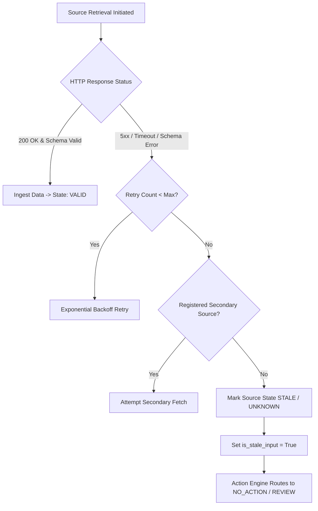

# PHASE F.8 — DATA FAILURE & DEGRADATION GOVERNANCE SPECIFICATION

## Executive Summary

This specification establishes the formal mathematical and structural governance governing data failure, missing evidence, source outages, identity ambiguities, and quality degradation across the mutual-fund decision engine.

---

## 1. Fundamental Safety Theorem: Uncertainty Monotonicity

$$\text{Theorem: } \forall \text{ Input States } S_1, S_2 \text{ where } S_2 \text{ represents a degraded or less complete evidence state of } S_1:$$

$$\mathcal{P}_{\text{transaction}}(S_2) \le \mathcal{P}_{\text{transaction}}(S_1)$$

$$\text{where } \mathcal{P}_{\text{transaction}} \in \{\text{BUY}, \text{ACCUMULATE}, \text{SELL}\} \rightarrow \{\text{NO\_ACTION}, \text{HOLD}, \text{REVIEW}\}$$

### Core Principle
Data quality degradation, missing inputs, source outages, or uncertainty **MUST NEVER INCREASE TRANSACTION PROPENSITY**. Degraded evidence strictly forces non-transactional outcomes (`NO_ACTION`, `HOLD`, `REVIEW`, `INSUFFICIENT_INFORMATION`).

---

## 2. End-to-End Data Degradation Propagation Pathways

```
[DATA FAILURE MODE] ──► [METRIC IMPACT] ──► [ENGINE IMPACT] ──► [DECISION OUTCOME]
```

### Scenario 1: Missing Historical NAV Records
- **Data Failure**: Ingestion API returns missing 24-month NAV window for Scheme $X$.
- **Metric Impact**: Metric Engine cannot compute 3-year rolling returns, downside deviation, or drawdown. Metrics evaluate to `None`.
- **Engine Impact**: Quality Engine detects missing dimensions. Composite `quality_score` becomes `None` and `fund_quality_evidence_valid` becomes `False`.
- **Decision Outcome**: Action Engine Tier 6 evaluates `fq_ev_valid is not True`. Transaction blocked with `primary_reason_code='INSUFFICIENT_EVIDENCE'` and `action_state=ActionState.NO_ACTION`.

### Scenario 2: Unresolved Identity Conflict
- **Data Failure**: Scheme name maps to two distinct AMFI codes without explicit ISIN confirmation.
- **Metric Impact**: Data normalization pipeline halts metric computation for Scheme $X$.
- **Engine Impact**: Scheme marked `QUARANTINED`. Integration contract returns `status=IntegrationStatus.INVALID`.
- **Decision Outcome**: Suitability and Need Engine return `INVALID_ASSESSMENT`. Action Engine halts execution at Tier 1 with `action_state=ActionState.INVALID_ASSESSMENT`.

### Scenario 3: Missing TER (Expense Ratio) Disclosure
- **Data Failure**: AMC EOD feed omits current TER disclosure.
- **Metric Impact**: Cost efficiency metric cannot be calculated.
- **Engine Impact**: `tax_liability_known` or `transaction_costs_known` evaluate to `None` / `False`. Economic Benefit Engine returns `BENEFIT_UNCERTAIN` or `INSUFFICIENT_INFORMATION`.
- **Decision Outcome**: `BUY` path evaluates to `NO_ACTION` (`ECONOMIC_BENEFIT_UNKNOWN`). `SELL` path evaluates to `REVIEW` (`TAX_COST_INFORMATION_MISSING`). Zero cost is **NEVER** assumed.

### Scenario 4: Missing SEBI Riskometer Disclosure
- **Data Failure**: Riskometer disclosure feed unavailable for newly launched Scheme $Y$.
- **Metric Impact**: Risk classification field is `None`.
- **Engine Impact**: Riskometer tier cannot be inferred from volatility or category. Suitability Engine cannot complete risk alignment step.
- **Decision Outcome**: Suitability Assessment Result yields `suitability_status=SuitabilityStatus.INSUFFICIENT_INFORMATION`. Action Engine produces `action_state=ActionState.INSUFFICIENT_INFORMATION`.

---

## 3. Source Failure & Network Outage Governance

When an external data source fails (HTTP 5xx, timeout, malformed payload, connection reset):



### Mandatory Constraints During Outages
1. **No Zero Fill**: Network outages must **NEVER** result in `0.0` or empty strings being written into financial fields.
2. **No Favorable Default**: Missing evidence resulting from outages must evaluate to `None` / `UNKNOWN`.
3. **No Transaction Execution**: Outages automatically lock out `BUY` and `SELL` recommendations across affected schemes.

---

## 4. Failure Mode Handling & Safety Assurance

| Data Failure Mode | Primary Safety Defense | Downstream State | Transaction Impact |
| :--- | :--- | :--- | :--- |
| **Missing NAV Gap** | Metric Engine NaN Guardrail | `INSUFFICIENT_EVIDENCE` | **BUY / SELL Blocked** |
| **Identity Conflict** | Resolver Quarantine Engine | `QUARANTINED` / `INVALID` | **BUY / SELL Blocked** |
| **Missing TER** | Economic Benefit Guardrail | `TAX_COST_MISSING` | **BUY Blocked; SELL -> REVIEW** |
| **Missing Riskometer** | Suitability Guardrail | `INSUFFICIENT_INFO` | **BUY / SELL Blocked** |
| **API Outage** | Staleness Monitor (`is_stale_input`) | `STALE` | **BUY -> NO_ACTION; SELL -> REVIEW** |
| **Version Mismatch** | Integration Contract Inspector | `VERSION_MISMATCH` | **BUY / SELL Blocked** |
