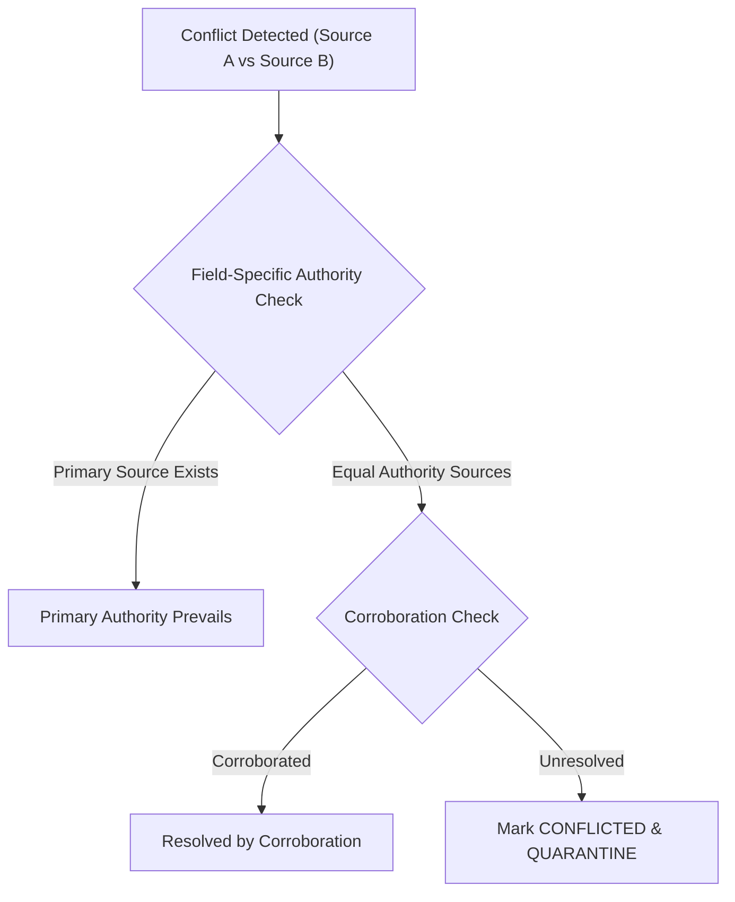

# PHASE F.8 — DATA & PRODUCTION-READINESS GOVERNANCE SPECIFICATION

## Executive Summary

Phase F.8 establishes the formal production-readiness governance framework for the India mutual-fund decision engine. It defines the strict data quality, source authority, point-in-time (PIT) validity, identity resolution, coverage ledger, degradation safety, and production eligibility gates required before real-world mutual-fund data can drive live investor recommendations.

> [!IMPORTANT]
> This document is **SPECIFICATION AND GOVERNANCE ONLY**. It introduces zero production code modifications, zero new financial scoring rules, zero arbitrary financial thresholds, and zero changes to the approved 7-tier decision architecture:
> $$\text{DATA} \rightarrow \text{METRIC ENGINE} \rightarrow \text{FUND QUALITY} \rightarrow \text{SUITABILITY} \rightarrow \text{PORTFOLIO NEED} \rightarrow \text{ECONOMIC BENEFIT} \rightarrow \text{ACTION}$$

---

## 1. Production Readiness Definition & Dimensions

Passing automated software unit and integration tests does **NOT** establish financial production readiness. Software correctness must be distinguished from data completeness and financial trustworthiness.

### 1.1 The 5 Data Governance Tier Disambiguation

| Governance Tier | Definition | Example State | Downstream Eligibility |
| :--- | :--- | :--- | :--- |
| **SOURCE AVAILABLE** | An external HTTP endpoint or file exists and responds to network requests. | AMFI daily NAV text file accessible at amfiindia.com. | **Ineligible** for financial evaluation. |
| **SOURCE TRUSTWORTHY** | The source has undergone formal governance validation, authority assignment, and licensing verification. | AMFI official portal registered with `authority_level=PRIMARY`. | **Ineligible** without record validation. |
| **FIELD VALID** | A specific retrieved field satisfies schema types, range bounds, date sanity, and checksum integrity. | Current NAV = ₹145.23 on 2026-09-11 (Positive decimal). | Eligible for metric computation. |
| **DATASET COMPLETE** | The scheme has required historical depth, TER, Riskometer, and benchmark coverage without missing gaps. | 5-year daily NAV series with complete TER history. | Eligible for Fund Quality scoring. |
| **PRODUCTION-ELIGIBLE** | Fully validated upstream evidence across all domains (Quality, Suitability, Need, Benefit, Action). | Scheme satisfies all 7 decision engine tiers. | **Eligible for Recommendation**. |

### 1.2 The 20 Production Readiness Dimensions

1. **Source Readiness**: Verified primary/secondary source registration in the Source Registry with licensing and authority bounds.
2. **Retrieval Readiness**: Network pipeline stability, retry safety, rate-limit compliance, and error logging.
3. **Schema / Readability Readiness**: Structural integrity of ingestion payloads (JSON/CSV/HTML/XML) matching schema specs.
4. **Identity Readiness**: Unambiguous mapping to a `canonical_scheme_id` via AMFI code, ISIN, AMC, plan, and option.
5. **Field Validity**: Field-level bounds enforcement (e.g., non-negative NAV, valid ISO dates, positive TER).
6. **Field Completeness**: Presence of mandatory fields required for specific domain evaluations.
7. **Observation-Date Validity**: Verified temporal accuracy of observation dates relative to reporting timestamps.
8. **Point-In-Time (PIT) Validity**: Strict anti-look-ahead isolation relative to assessment date $T$.
9. **Historical Coverage**: Ledger-verified historical NAV continuity and missing interval tracking.
10. **Lifecycle Readiness**: Traceable corporate action history (creation, rename, merger, closure, rebrand, plan split).
11. **Category / Subcategory Readiness**: Valid SEBI 2017 categorization and strategy tagging at observation date $T$.
12. **Plan / Option Readiness**: Explicit, non-interchangeable tracking of Direct vs. Regular and Growth vs. IDCW.
13. **Cost / TER Readiness**: Current and historical TER completeness without synthetic fallback zeroing.
14. **Riskometer Readiness**: Official SEBI Riskometer tier assignment without inference from volatility or category.
15. **Benchmark Readiness**: Validated benchmark index mapping, TRI (Total Return Index) availability, and observation alignment.
16. **Provenance Readiness**: Complete backward lineage from derived value to raw source fact URL, timestamp, and methodology version.
17. **Validation Readiness**: Cross-source corroboration and checksum verification before dataset commitment.
18. **Conflict Resolution Readiness**: Deterministic field-level authority resolution or quarantine routing on disagreement.
19. **Consumer / Dependency Readiness**: Verified interface contract compatibility across domain engine boundaries.
20. **Production Recommendation Readiness**: Complete fulfillment of Tier 1–7 decision engine prerequisites.

---

## 3. Source Registry Governance

The Source Registry is a production governance object. Every external data stream must be registered and assigned explicit field-level authority boundaries.

### 3.1 Source Registry Object Schema

| Attribute | Type | Description | Governance Constraint |
| :--- | :--- | :--- | :--- |
| `source_id` | `str` | Unique canonical identifier (e.g., `SRC_AMFI_OFFICIAL`). | Immutable. |
| `source_name` | `str` | Human-readable name of the provider. | Required. |
| `source_type` | `Enum` | `REGULATOR`, `OFFICIAL_UTILITY`, `AMC_DIRECT`, `THIRD_PARTY_VENDOR`. | Governs baseline authority. |
| `authority_level` | `Enum` | `PRIMARY`, `SECONDARY`, `TERTIARY_UNVALIDATED`. | Field-specific; no global override. |
| `official_url` | `str` | Primary domain URL. | Required. |
| `specific_endpoint_url` | `str` | Exact API or file retrieval endpoint. | Required. |
| `supported_fields` | `List[str]` | List of fields authorized for retrieval from this source. | Explicit whitelist. |
| `retrieval_method` | `Enum` | `HTTP_GET`, `SFTP`, `REST_API`, `MANUAL_INGEST`. | Technical protocol. |
| `update_frequency` | `Enum` | `DAILY_REALTIME`, `DAILY_EOD`, `MONTHLY`, `ADHOC`. | Used for staleness calculation. |
| `historical_depth` | `str` | Claimed historical coverage range. | Unvalidated until ledger checked. |
| `licensing_constraints` | `str` | Legal terms of use and data redistribution constraints. | Mandatory compliance check. |
| `validation_status` | `Enum` | `VALIDATED`, `PROVISIONAL`, `SUSPENDED`, `DEPRECATED`. | Must be `VALIDATED` for production. |
| `last_retrieval_utc` | `datetime` | UTC timestamp of last attempted fetch. | Technical tracking. |
| `last_success_utc` | `datetime` | UTC timestamp of last successful fetch. | Used for source health monitor. |
| `conflict_policy` | `Enum` | `AUTHORITY_PREVAILS`, `CORROBORATION_REQUIRED`, `QUARANTINE_ON_DISAGREEMENT`. | Governs source disagreement. |

---

## 5. Historical NAV Coverage Governance

Historical NAV endpoint availability does **NOT** equal universe-wide historical completeness.

### 5.1 Historical Coverage Ledger Schema

The Coverage Ledger (`models/nav_data.py` / `data/repositories/`) tracks scheme-level continuity:

```python
# Governance Data Schema representation
{
    "canonical_scheme_id": "INF209K01157",
    "requested_start_date": "2015-01-01",
    "requested_end_date": "2026-09-11",
    "earliest_observed_date": "2015-01-02",
    "latest_observed_date": "2026-09-11",
    "total_expected_business_days": 2930,
    "total_observed_records": 2922,
    "missing_intervals": [
        {"start": "2018-04-12", "end": "2018-04-15", "count": 2, "reason": "UNEXPLAINED_GAP"}
    ],
    "historical_completeness_ratio": 0.9972,
    "coverage_status": "SUFFICIENT_FOR_5Y",
    "last_checksum_hash": "a8f5c...3e1"
}
```

### 5.2 Impact of Incomplete History on Downstream Analytics

1. **Maturity Evaluation**: Fund maturity is calculated strictly from earliest observed inception date $T_{\text{incept}}$. If history is shorter than 36 months, the fund is flagged as immature in Suitability.
2. **Return & Volatility Metrics**: Missing NAV gaps that breach metric calculation windows prevent rolling return, downside deviation, and max drawdown calculations. Metrics evaluate to `None`. Missing intervals are recorded in the Coverage Ledger.
3. **Fund Quality Scoring**: Missing metrics degrade score dimension weights. If available dimensions fall below required limits, `quality_score` becomes `None` and `is_evidence_valid` becomes `False`.
4. **Production Eligibility**: A scheme with invalid Fund Quality evidence cannot enter a `BUY` or `SELL` transaction path.

---

## 6. Point-In-Time (PIT) Governance & Anti-Look-Ahead Controls

Every historical decision evaluation at date $T$ must consume strictly the data state published and available on or before date $T$.

### 6.1 Temporal Attribute Matrix & Availability Semantics

- $T_{\text{assess}}$: The date as of which the investment decision is being made.
- $T_{\text{obs}}$: The date of the underlying market observation (e.g., NAV observation date).
- $T_{\text{pub}}$: The official publication/availability timestamp by the primary authority.
- $T_{\text{ingest}}$: The platform system timestamp when data was ingested.

Where publication/availability date is a recorded attribute, the anti-look-ahead isolation condition is:

$$T_{\text{obs}} \le T_{\text{pub}} \le T_{\text{assess}}$$

The fundamental production requirement is that **information used in a historical assessment must have been available to the assessment process as of assessment date $T$**. Post-assessment information MUST NOT leak into historical assessments. A later correction to an earlier observation spawns a new dataset version and does **NOT** automatically overwrite prior historical assessment audit trails.

### 6.2 Strict Prohibitions

1. **Category Backward Projection Prohibited**: A scheme classified as "Mid Cap" in 2026 that was "Small Cap" in 2019 must be evaluated as "Small Cap" for all historical $T < \text{SEBI Reclassification Date}$.
2. **Post-$T$ Lifecycle Leakage Prohibited**: A scheme merger occurring after date $T$ must not affect risk or quality calculations at date $T$.
3. **Post-$T$ TER & Riskometer Leakage Prohibited**: TER revisions or Riskometer tier shifts published after date $T$ cannot be used at date $T$.
4. **Future Benchmark Data Prohibited**: Benchmark observations published after $T$ cannot enter risk calculation at $T$.

---

## 7. Scheme Identity & Lifecycle Production Readiness

Preserve Master Governance Directives MD-1 through MD-5:

- **MD-1 (Date Precision)**: Lifecycle events must maintain explicit date precision (`DAY`, `MONTH`, `YEAR`).
- **MD-2 (AMFI Code Reassignment)**: Reassigned AMFI codes require evidence of economic scheme continuity.
- **MD-3 (ISIN Changes)**: ISIN modifications require manual review and do not automatically establish scheme continuity.
- **MD-4 (No NAV Stitching)**: NAV series of merged predecessor schemes must **NEVER** be stitched to successor scheme NAV series.
- **MD-5 (Lifecycle Resolution Isolation)**: Scheme lifecycle resolution remains independent of NAV ingestion.

---

## 8. Category, Subcategory, & Strategy Readiness

Peer group evaluations for Fund Quality require strict category context validation:
- Peer comparisons are valid **ONLY** within identical subcategories (e.g., Large Cap vs. Large Cap).
- Cross-category ranking (e.g., Equity vs. Debt, Large Cap vs. Small Cap) is **STRICTLY PROHIBITED**.
- Sectoral and thematic funds must be evaluated against strategy-matched peer groups.

---

## 9. Plan, Option, & Distribution Treatment

1. **Direct vs. Regular Plans**: Direct and Regular plans represent separate economic contracts due to differing expense ratios (TER). They must retain distinct `canonical_scheme_id`s and never be merged.
2. **Growth vs. IDCW Options**: Growth and Income Distribution cum Capital Withdrawal (IDCW) options have distinct cash-flow treatments.
3. **IDCW Total Return Reconstruction**: IDCW NAV drops upon distribution payout. Until total-return NAV reconstruction (NAV + reinvested IDCW) is implemented and validated, IDCW return calculations remain **UNAVAILABLE / PROVISIONAL**.

---

## 10. TER & Cost Data Readiness

- **Current TER**: Retrieved from AMC EOD disclosures or AMFI monthly TER publications.
- **Historical TER Limitation**: Pre-2018 historical TER coverage in India is incomplete across vendors.
- **Zero Cost Fallback Prohibited**: Missing TER must **NEVER** default to `0.0`. Missing TER sets `tax_cost_information_missing=True`, routing Action Engine `SELL` evaluations to `REVIEW`.

---

## 11. Exit Load Data Governance

- Exit load details (percentage, holding period threshold, tier structure) must be retrieved from official scheme document filings or AMC EOD feeds.
- Default exit load values (e.g., assuming 1% or 0%) are **STRICTLY PROHIBITED**.
- If exit load is missing, `exit_load_known` evaluates to `False` / `None`, blocking `SELL` transactions and routing to `REVIEW`.

---

## 12. Riskometer / Fund Risk Data Governance

- Fund risk classification must consume official SEBI Riskometer disclosures (`Low`, `Low to Moderate`, `Moderate`, `Moderately High`, `High`, `Very High`).
- Riskometer tiers must **NEVER** be inferred from volatility, drawdown, category averages, or investor profiles.
- If Riskometer data is missing, Suitability cannot verify risk alignment, producing `INSUFFICIENT_INFORMATION`.

---

## 13. Benchmark Data Governance

- **Benchmark TRI Dependency**: Benchmark TRI (Total Return Index) is required **ONLY** for metrics or methodologies that explicitly depend on validated TRI data.
- **No Universal Block**: Benchmark availability does **NOT** universally block Fund Quality unless the applicable approved scoring methodology explicitly requires validated benchmark data.
- **Unresolved Methodology**: Where benchmark relative methodology is unresolved, it remains **`TBD — REQUIRES VALIDATION`**.

---

## 14. Provenance & Evidence Governance

Every material metric and decision payload must maintain traceable evidence:
- **Source Fact**: Direct raw observation from external authority (e.g., NAV ₹150.0 from AMFI on 2026-09-11).
- **Platform-Derived Value**: Value computed by Metric Engine or Quality Engine. Derived values must store `source_input_ids`, `calculation_method`, `methodology_version`, and `rule_version`.

---

## 15. Conflict Resolution Governance

When two sources report conflicting data for the same field at date $T$:



Field-specific conflict tolerance thresholds (if required in future phases) remain **`TBD — REQUIRES FIELD-SPECIFIC VALIDATION`**. No universal numerical conflict tolerance is assumed in F.8.

---

## 18. Source Failure & Outage Governance

Network outages, HTTP 5xx errors, schema shifts, or incomplete source payloads must fail safely:
- Retries follow exponential backoff.
- Incomplete payloads trigger fallback to acceptable secondary sources if registered.
- If no secondary source exists, affected fields become `UNKNOWN` or `STALE`.
- **Outages must NEVER generate zero values, synthetic fallbacks, or authorize transactions.**

---

## 19. Data Versioning & Reproducibility

An assessment conducted for Investor $I$ on Date $T$ must be 100% reproducible:

$$\text{Assessment Result} = f\left(\text{Data Snapshot}_T, \text{Profile Snapshot}_T, \text{Methodology Version}, \text{Rule Version}\right)$$

If historical source data is retroactively corrected by an AMC or regulator, the platform issues a new dataset version while preserving the original historical snapshot for audit.

---

## 20. Audit Trail & Change Control

Material changes to Source Registry, scheme mappings, lifecycle events, category classifications, historical NAVs, TERs, or Riskometers require:
- `change_id`, `changed_by`, `timestamp_utc`, `justification`, `source_reference_url`, and `approval_id`.

---

## 21. Production / Research / Test Data Modes

1. **PRODUCTION Mode**: Operates exclusively on validated real-world sources and governed configurations.
2. **RESEARCH Mode**: Operates on experimental metrics or provisional sources. Research outputs **CANNOT** drive live recommendations.
3. **TEST Mode**: Uses synthetic fixtures for software testing. Test data is strictly isolated from production pipelines.

---

## 22. Data Quality Dashboard Specification

The operational Data Quality Dashboard monitors:
- Source API health, HTTP latency, and failure rates.
- Ingestion pipeline success and missing NAV intervals.
- Quarantined schemes and unresolved identity conflicts.
- PIT classification effective date coverage.
- TER, Exit Load, and Riskometer disclosure completeness ratios.

---

## 23. Data-to-Decision Traceability Chain

Every recommendation must be fully traceable backward:

$$\text{User Recommendation} \leftarrow \text{Action Result} \leftarrow \text{Economic Benefit} \leftarrow \text{Portfolio Need} \leftarrow \text{Suitability} \leftarrow \text{Fund Quality} \leftarrow \text{Metric Engine} \leftarrow \text{Raw Source Fact}$$

The system must present exact source URL, retrieval date, methodology version, and constraint rules for every decision.

---

## 24. Production Recommendation Safety Classes

| Safety Class | Description | Transaction Permitted |
| :--- | :--- | :--- |
| **CLASS 1: PRODUCTION_RECOMMENDATION** | Complete validated upstream evidence across Tiers 1–7. | **BUY / ACCUMULATE / SELL** |
| **CLASS 2: NON_TRANSACTIONAL_ASSESSMENT** | Valid evaluation showing no action required. | **HOLD / MONITOR** |
| **CLASS 3: REVIEW_REQUIRED** | Material deterioration or missing tax/cost/replacement info. | **REVIEW** (Manual) |
| **CLASS 4: INSUFFICIENT_INFORMATION** | Missing risk alignment, suitability, or quality evidence. | **NO_ACTION** |
| **CLASS 5: QUARANTINED** | Identity conflict or disputed source data. | **NO_ACTION** |
| **CLASS 6: RESEARCH_ONLY** | Experimental feature evaluation. | **Prohibited** |
| **CLASS 7: TEST_ONLY** | Synthetic test execution. | **Prohibited** |

---

## 25. Financial Methodology Boundary (Unresolved TBD Items)

The following 15 provisional items remain **`TBD — REQUIRES VALIDATION`** and are **NOT** authorized as final production methodology in Phase F.8:

1. Category weighting parameters in Fund Quality Engine.
2. Dynamic downside risk multiplier formulas.
3. Peer group size threshold scaling.
4. Confidence score calibration mappings.
5. IDCW total-return reconstruction methodology.
6. Historical pre-2018 TER interpolation.
7. Benchmark relative risk metrics.
8. Riskometer numeric equivalence mapping.
9. Risk Capacity scoring weightings.
10. Risk Tolerance psychometric question scoring.
11. Risk Alignment staleness decay functions.
12. Portfolio Need gap magnitude scoring.
13. Economic Benefit threshold calibration.
14. Tax and Exit Load calculation engines.
15. Field-specific numerical conflict tolerances (`TBD — REQUIRES FIELD-SPECIFIC VALIDATION`).

---

## 27. Acceptance Criteria

- **AC-01**: Missing/omitted safety-critical fields strictly evaluate to `None`/`UNKNOWN` and never default favorably.
- **AC-02**: Source availability is explicitly distinguished from dataset completeness and production eligibility.
- **AC-03**: Historical NAV coverage is tracked at the scheme level using the Coverage Ledger.
- **AC-04**: Point-in-time isolation prevents post-$T$ look-ahead leakage.
- **AC-05**: Category reclassifications are applied effective-date specifically and never projected backward.
- **AC-06**: Scheme identity ambiguity or conflict forces scheme quarantine.
- **AC-07**: NAV series of merged schemes are never stitched.
- **AC-08**: Direct and Regular plans are explicitly isolated.
- **AC-09**: Growth and IDCW options are explicitly isolated.
- **AC-10**: Missing TER never defaults to zero.
- **AC-11**: Missing exit load never defaults to zero.
- **AC-12**: Missing Riskometer data is never inferred.
- **AC-13**: Source conflicts are routed to field-level authority check or quarantine.
- **AC-14**: Third-party sources require formal registration and validation.
- **AC-15**: Platform-derived values preserve raw input provenance and calculation methodology version.
- **AC-16**: Data quality degradation strictly decreases transaction propensity.
- **AC-17**: Production BUY/SELL recommendations require all decision prerequisites that are applicable and required for the specific decision path to be fully satisfied and validated (Tier 1–7 evidence).
- **AC-18**: Research and test data cannot drive production outputs.
- **AC-19**: Historical decision evaluations are reproducible.
- **AC-20**: Retroactive source corrections spawn new data snapshot versions without overwriting historical audit trails.
- **AC-21**: All unresolved financial methodology items remain explicitly designated as `TBD — REQUIRES VALIDATION`.
- **AC-22**: Real-World Testing Stages A through G are explicitly defined.
- **AC-23**: F.8 does **NOT** authorize autonomous real-money transaction execution.

---

## 28. Specification-Only Test Plan

The implementation and QA test plan for future data pipeline validation covers:
1. **Source Tests**: Outage, 500 server error, malformed JSON, schema shift, rate-limiting, conflict quarantine.
2. **Identity Tests**: AMFI code reassignment, ISIN change, scheme merger, AMC rebrand, ambiguous name matching quarantine.
3. **Historical Coverage Tests**: Missing NAV gap detection, weekend date skipping, short history maturity flagging.
4. **PIT Isolation Tests**: Category change look-ahead attempt, post-$T$ TER leakage, post-$T$ Riskometer leakage.
5. **Plan / Option Tests**: Direct vs. Regular TER mismatch, IDCW drop without total return reconstruction.
6. **Cost & Risk Tests**: Missing TER fallback zero attempt prevention, missing Riskometer inference prevention.
7. **Safety Monotonicity Tests**: Source outage during BUY evaluation -> `NO_ACTION`; source outage during SELL evaluation -> `REVIEW`.

---

## 34. Implementation Readiness Checklist for Future Phase F.8.x

- [ ] Production Source Adapters (AMFI, NSE/BSE, AMC Direct EOD)
- [ ] Source Registry Operationalization & Licensing Verification
- [ ] Automated Coverage Ledger Ingestion & Gap Monitor
- [ ] Universe-Wide Scheme Identity Resolution & Mapping Pipeline
- [ ] Scheme Lifecycle Event Ingestion & MD-1..MD-5 Enforcement
- [ ] Point-In-Time SEBI Category History Database
- [ ] Verified EOD TER Disclosure Feed Ingestion
- [ ] Verified Official SEBI Riskometer Disclosure Feed Ingestion
- [ ] Verified Benchmark TRI Index Ingestion Pipeline
- [ ] Derived Metric Provenance & Lineage Tracker
- [ ] Automated Source Conflict Detection & Quarantine Engine
- [ ] Data Quality Operational Dashboard
- [ ] Real-World Shadow Testing Infrastructure (Stages A–E)

---

## 35. Real-World Validation Roadmap

```
Phase F.8: Data & Production-Readiness Governance (Specification)
   │
   ▼
Phase F.8.x: Real Data Infrastructure & Source Adapters Implementation
   │
   ▼
Phase F.9: Production-Like Mutual-Fund Dataset Construction
   │
   ▼
Phase F.10: Historical Backtest & Shadow Evaluation
   │
   ▼
Phase F.11: Financial Methodology Validation & Calibration
   │
   ▼
Phase F.12: Human-Supervised Real-World Pilot
   │
   ▼
Phase F.13: Production Readiness Review
   │
   ▼
Future Controlled Transaction Integration
```

> [!CAUTION]
> Passing Phase F.8 does **NOT** mean the engine is authorized for real-money investments. Phase F.8 establishes the governance baseline required to reach real-world testing safely.
