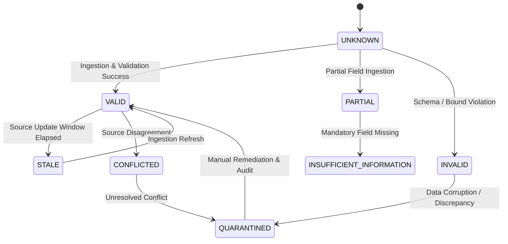

# PHASE F.8 — DATA QUALITY STATE MODEL SPECIFICATION

## Executive Summary

This specification defines the formal 8-state Data Quality State Model for the India mutual-fund decision engine. It establishes explicit entry/exit conditions and downstream consumption rules across all decision tiers (`FUND QUALITY`, `SUITABILITY`, `PORTFOLIO NEED`, `ECONOMIC BENEFIT`, `ACTION`).

---

## 1. Overview of Data Quality States

---

## 2. State-by-State Governance Matrix

### 2.1 State: `VALID`
- **Meaning**: Complete, schema-compliant, temporally consistent, and corroborated data record.
- **Entry Conditions**: All mandatory fields present, range bounds satisfied, checksum valid, source primary/secondary registered.
- **Exit Conditions**: Observation window expires (transitions to `STALE`), conflicting source ingest (transitions to `CONFLICTED`).
- **Downstream Behavior**:
  - Downstream Consumption: **Permitted**
  - Score Calculation: **Permitted**
  - Confidence Reduction: None (Full confidence 1.0)
  - Suitability Consumption: **Permitted**
  - Economic Benefit Consumption: **Permitted**
  - Action Engine Consumption: **Permitted**
  - Transaction Recommendation (`BUY`/`SELL`): **Permitted**
  - Manual Review Required: **No**

### 2.2 State: `PARTIAL`
- **Meaning**: Data record is valid for a subset of non-critical fields, but lacks optional metrics or non-mandatory history.
- **Entry Conditions**: Core identity and current NAV valid; secondary metric history (e.g., 5-year rolling returns) incomplete.
- **Exit Conditions**: Full historical retrieval succeeds (transitions to `VALID`), mandatory field omitted (transitions to `INSUFFICIENT_INFORMATION`).
- **Downstream Behavior**:
  - Downstream Consumption: **Restricted** (Available fields only)
  - Score Calculation: **Provisional / Partial** (Dimension weight redistribution)
  - Confidence Reduction: **Applied** (Confidence score reduced proportionally)
  - Suitability Consumption: **Permitted** (With confidence reduction)
  - Economic Benefit Consumption: **Permitted** (If benefit evaluable)
  - Action Engine Consumption: **Restricted** (`ACCUMULATE`/`HOLD` only; `BUY` requires complete evidence)
  - Transaction Recommendation (`BUY`/`SELL`): **Prohibited for BUY** (`ACCUMULATE`/`HOLD` permitted)
  - Manual Review Required: **No**

### 2.3 State: `UNKNOWN`
- **Meaning**: Default state for missing, omitted, or un-retrieved data inputs.
- **Entry Conditions**: Field omitted in request payload, uninitialized contract, or un-queried source.
- **Exit Conditions**: Successful ingestion (transitions to `VALID` or `PARTIAL`), retrieval failure (transitions to `INSUFFICIENT_INFORMATION`).
- **Downstream Behavior**:
  - Downstream Consumption: **Prohibited for Transactions**
  - Score Calculation: **Evaluates to `None`**
  - Confidence Reduction: Maximum reduction
  - Suitability Consumption: Yields `INSUFFICIENT_INFORMATION`
  - Economic Benefit Consumption: Yields `BENEFIT_UNCERTAIN`
  - Action Engine Consumption: Routes to `NO_ACTION` (for BUY) or `REVIEW` (for SELL)
  - Transaction Recommendation (`BUY`/`SELL`): **STRICTLY PROHIBITED**
  - Manual Review Required: **Only if existing position (`REVIEW`)**

### 2.4 State: `INSUFFICIENT_INFORMATION`
- **Meaning**: Data retrieval attempted, but mandatory fields required for financial calculation are missing.
- **Entry Conditions**: Missing 36-month NAV history, missing Riskometer tier, or missing investor profile inputs.
- **Exit Conditions**: Data source update provides missing mandatory fields (transitions to `VALID`).
- **Downstream Behavior**:
  - Downstream Consumption: **Prohibited for Transactions**
  - Score Calculation: **Evaluates to `None`** (`is_evidence_valid=False`)
  - Confidence Reduction: Score set to `0.0`
  - Suitability Consumption: Status set to `INSUFFICIENT_INFORMATION`
  - Economic Benefit Consumption: Status set to `INSUFFICIENT_INFORMATION`
  - Action Engine Consumption: Primary reason `INSUFFICIENT_EVIDENCE` / `INSUFFICIENT_INPUT`
  - Transaction Recommendation (`BUY`/`SELL`): **STRICTLY PROHIBITED**
  - Manual Review Required: **No** (Automatic `NO_ACTION`)

### 2.5 State: `INVALID`
- **Meaning**: Data record violates domain schemas, sanity bounds, temporal logic, or mathematical constraints.
- **Entry Conditions**: Negative NAV, NAV date in future, invalid ISIN format, TER > 100%, or unvalidated version mismatch.
- **Exit Conditions**: Correction ingestion (transitions to `VALID`), quarantine routing (transitions to `QUARANTINED`).
- **Downstream Behavior**:
  - Downstream Consumption: **STRICTLY PROHIBITED**
  - Score Calculation: **Evaluates to `None`**
  - Confidence Reduction: Set to `0.0`
  - Suitability Consumption: Status set to `INVALID_ASSESSMENT`
  - Economic Benefit Consumption: Status set to `INVALID_ASSESSMENT`
  - Action Engine Consumption: Action state set to `INVALID_ASSESSMENT`
  - Transaction Recommendation (`BUY`/`SELL`): **STRICTLY PROHIBITED**
  - Manual Review Required: **Yes** (Data corruption alert)

### 2.6 State: `CONFLICTED`
- **Meaning**: Two authoritative sources report contradictory values for the same field at observation date $T$.
- **Entry Conditions**: Primary and secondary sources report conflicting values beyond field-specific validation tolerance.
- **Exit Conditions**: Field-level authority resolution (transitions to `VALID`), unresolved disagreement (transitions to `QUARANTINED`).
- **Downstream Behavior**:
  - Downstream Consumption: **Prohibited for Transactional Fields**
  - Score Calculation: **Blocked for affected metrics**
  - Confidence Reduction: Applied
  - Suitability Consumption: Blocked if risk/suitability field conflicted
  - Economic Benefit Consumption: Blocked if NAV/cost conflicted
  - Action Engine Consumption: Primary reason `INSUFFICIENT_EVIDENCE`
  - Transaction Recommendation (`BUY`/`SELL`): **STRICTLY PROHIBITED**
  - Manual Review Required: **Yes**

### 2.7 State: `QUARANTINED`
- **Meaning**: Scheme or data record is explicitly locked out of decision engine processing due to unresolved identity, lifecycle, or data integrity issues.
- **Entry Conditions**: Ambiguous identity match, unvalidated scheme merger, severe data corruption, or unresolved source conflict.
- **Exit Conditions**: Manual data governance remediation and audit sign-off (transitions to `VALID`).
- **Downstream Behavior**:
  - Downstream Consumption: **STRICTLY PROHIBITED**
  - Score Calculation: **Blocked**
  - Confidence Reduction: Set to `0.0`
  - Suitability Consumption: **Blocked**
  - Economic Benefit Consumption: **Blocked**
  - Action Engine Consumption: State set to `NO_ACTION` / `INVALID_ASSESSMENT`
  - Transaction Recommendation (`BUY`/`SELL`): **STRICTLY PROHIBITED**
  - Manual Review Required: **Yes** (Mandatory Governance Review)

### 2.8 State: `STALE`
- **Meaning**: Data record was previously valid, but the expected source update window has elapsed without a new observation.
- **Entry Conditions**: Latest observation date is older than the source-defined disclosure update window.
- **Exit Conditions**: Ingestion of fresh observation date (transitions to `VALID`).
- **Downstream Behavior**:
  - Downstream Consumption: **Restricted**
  - Score Calculation: **Permitted with `is_stale_input=True` flag**
  - Confidence Reduction: Applied
  - Suitability Consumption: Passes `is_stale_input=True`
  - Economic Benefit Consumption: Passes `is_stale_input=True`
  - Action Engine Consumption: `ActionEvaluationContext` receives `is_stale_input=True`. Routes existing positions to `REVIEW` (`STALE_INPUT`) and new positions to `NO_ACTION`.
  - Transaction Recommendation (`BUY`/`SELL`): **PROHIBITED** (`BUY` blocked, `SELL` routed to `REVIEW`)
  - Manual Review Required: **Yes for existing positions**

---

## 3. Freshness & Staleness Governance

1. **No Universal Numerical Freshness Cutoff**: Freshness is signal-specific and source-specific, determined by the source-defined disclosure cadence (e.g. daily for market NAVs, monthly for TER and Riskometers).
2. **Upstream Propagation**: Data ingestion layers mark `is_stale_input=True`. Downstream engines consume this flag without inventing local thresholds.
3. **Action Engine Enforcement**: Action Engine Tier 3 checks `is_stale_input`. If `True`, new purchases yield `NO_ACTION` and existing holdings yield `REVIEW`.

---

## 4. Summary Matrix of Downstream Permissions

| Data Quality State | Score Calc | Suitability | Economic Benefit | Action BUY | Action SELL | Action HOLD/REVIEW | Manual Review |
| :--- | :--- | :--- | :--- | :--- | :--- | :--- | :--- |
| **VALID** | Allowed | Allowed | Allowed | **Allowed** | **Allowed** | Allowed | No |
| **PARTIAL** | Partial | Allowed | Allowed | **Blocked** | **Blocked** | Allowed | No |
| **UNKNOWN** | None | Insufficient | Uncertain | **Blocked** | **Blocked** | REVIEW | If Held |
| **INSUFFICIENT_INFO** | None | Insufficient | Insufficient | **Blocked** | **Blocked** | NO_ACTION | No |
| **INVALID** | None | Invalid | Invalid | **Blocked** | **Blocked** | INVALID | Yes |
| **CONFLICTED** | Blocked | Blocked | Blocked | **Blocked** | **Blocked** | REVIEW | Yes |
| **QUARANTINED** | Blocked | Blocked | Blocked | **Blocked** | **Blocked** | Blocked | Yes |
| **STALE** | Flagged | Flagged | Flagged | **Blocked** | **Blocked** | REVIEW | Yes |
